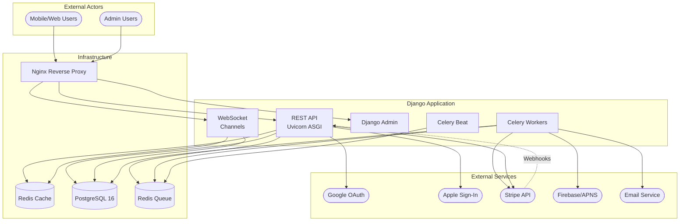
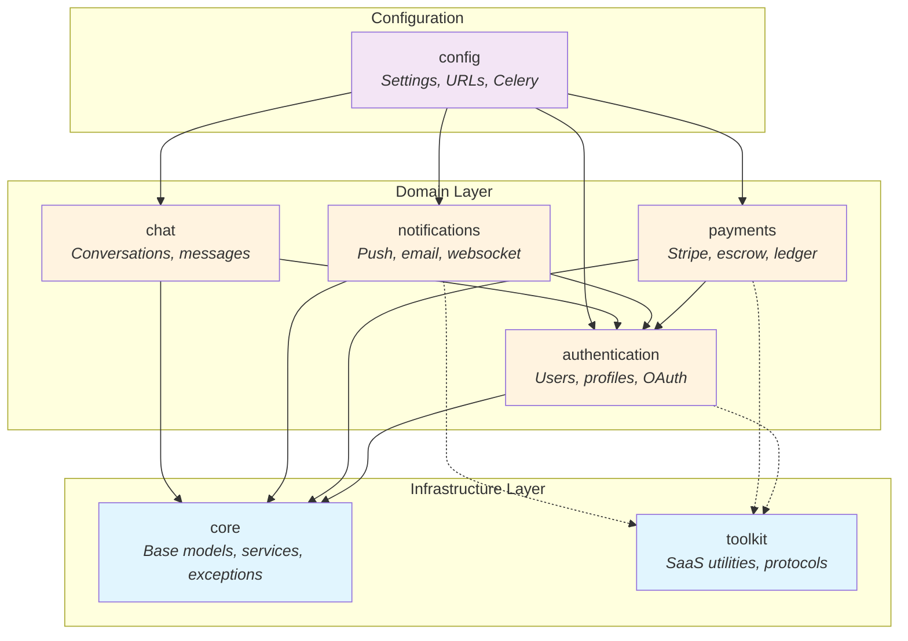
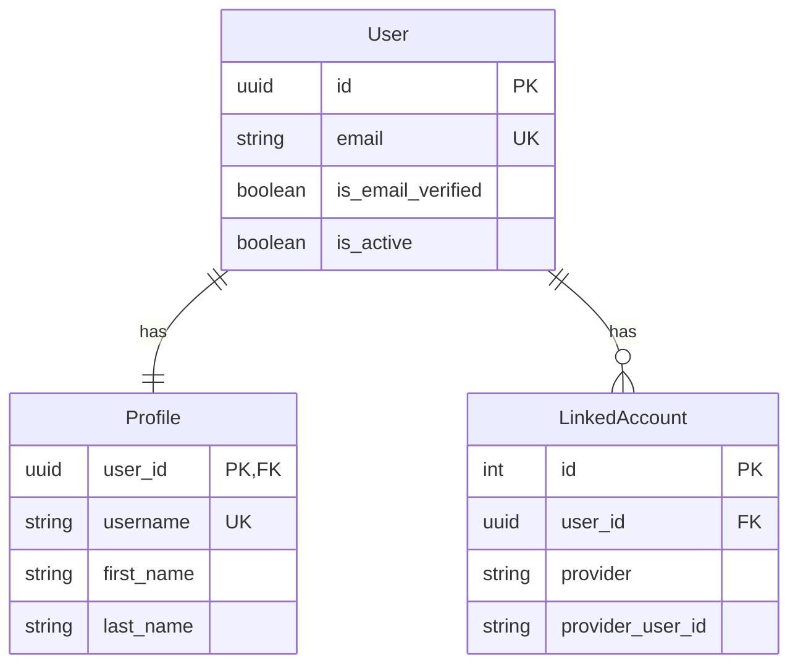
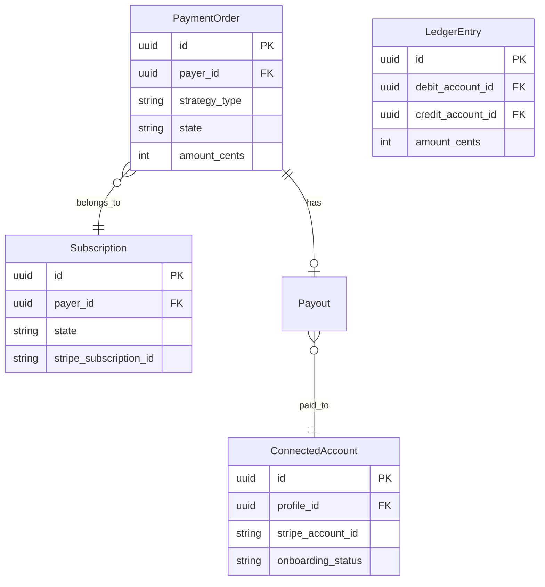
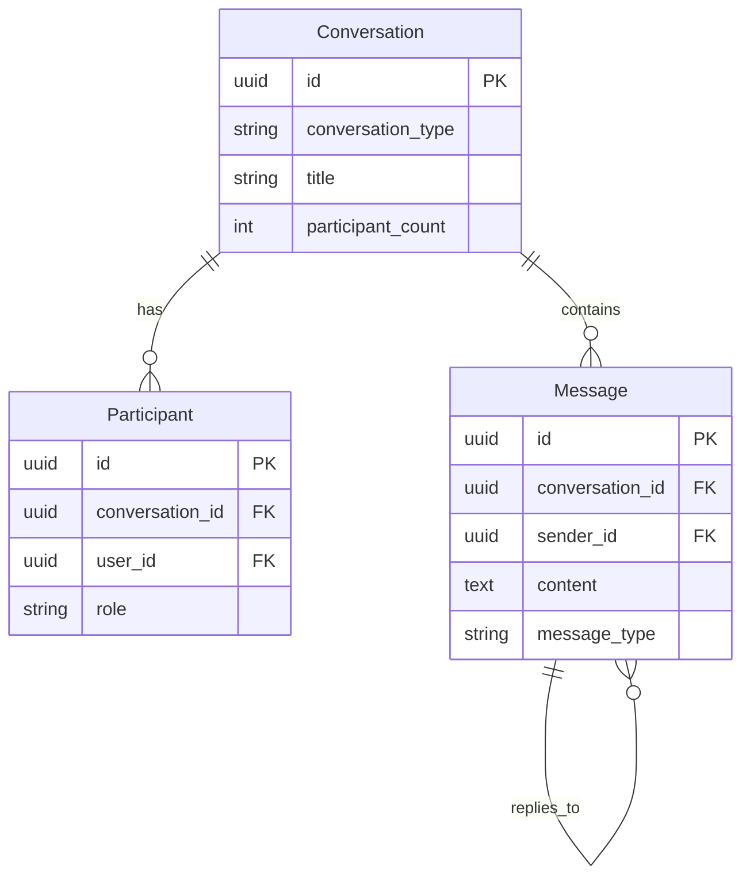
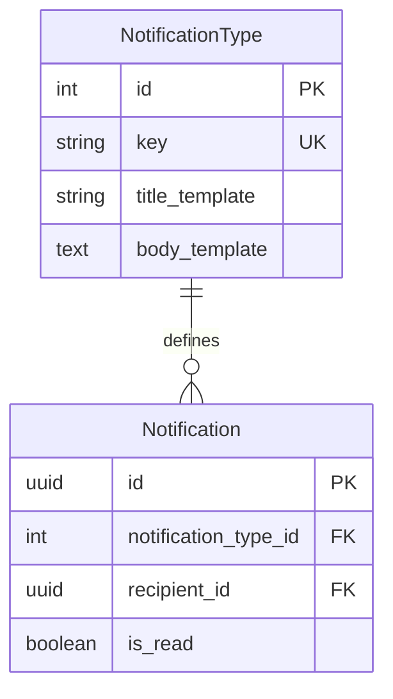

# Project Architecture

> Last generated: 2025-12-15 UTC

## Table of Contents

- [System Overview](#system-overview)
- [System Context](#system-context)
- [App Dependencies](#app-dependencies)
- [Data Model Overview](#data-model-overview)
- [API Structure](#api-structure)
- [App Reference](#app-reference)
- [Quick Links](#quick-links)

---

## System Overview

This is a Django 5.2 LTS SaaS backend skeleton providing pre-configured infrastructure for building modern web applications. The project implements a comprehensive set of features including REST API with JWT authentication, social OAuth (Google, Apple), biometric authentication, real-time chat via WebSockets, payment processing with Stripe (including escrow and subscriptions), push notifications, and background task processing with Celery.

The architecture follows a clean separation between domain-agnostic infrastructure (`core/`) and business-aware utilities (`toolkit/`), making it easy to extend without modifying the skeleton code. The service layer pattern with `ServiceResult` provides consistent error handling across all operations.

### Key Technical Decisions

| Decision | Implementation | Rationale |
|----------|----------------|-----------|
| **Auth Model** | Email-only (no username) | Modern UX, reduces friction |
| **Primary Keys** | UUID for User, auto-increment elsewhere | Security for user-facing IDs |
| **Service Pattern** | ServiceResult with error codes | Consistent API responses |
| **Payment Strategy** | Strategy pattern (Direct/Escrow/Subscription) | Flexible payment types |
| **Financial Tracking** | Double-entry ledger | Audit trail, reconciliation |
| **Real-time** | Django Channels + Redis | Scalable WebSocket support |
| **Background Tasks** | Celery + Redis | Reliable async processing |

---

## System Context



---

## App Dependencies



**Arrow Direction:** Dependent app points TO the app it imports from.

---

## Data Model Overview

### Authentication Domain



### Payments Domain



### Chat Domain



### Notifications Domain



---

## API Structure

All API routes are prefixed with `/api/v1/`.

### Authentication (`/api/v1/auth/`)

| Endpoint | Method | Description |
|----------|--------|-------------|
| `/login/` | POST | Email/password login |
| `/logout/` | POST | Logout (blacklist token) |
| `/registration/` | POST | User registration |
| `/user/` | GET/PUT/PATCH | Current user details |
| `/password/reset/` | POST | Request password reset |
| `/password/change/` | POST | Change password |
| `/profile/` | GET/PUT/PATCH | User profile |
| `/verify-email/` | POST | Verify email with token |
| `/google/` | POST | Google OAuth login |
| `/apple/` | POST | Apple Sign-In login |
| `/biometric/enroll/` | POST | Start biometric enrollment |
| `/biometric/authenticate/` | POST | Biometric authentication |

### Chat (`/api/v1/chat/`)

| Endpoint | Method | Description |
|----------|--------|-------------|
| `/conversations/` | GET/POST | List/create conversations |
| `/conversations/{id}/` | GET/PATCH/DELETE | Conversation detail |
| `/conversations/{id}/read/` | POST | Mark as read |
| `/conversations/{id}/leave/` | POST | Leave conversation |
| `/conversations/{id}/participants/` | GET/POST | Manage participants |
| `/conversations/{id}/messages/` | GET/POST | List/send messages |

### Notifications (`/api/v1/notifications/`)

| Endpoint | Method | Description |
|----------|--------|-------------|
| `/` | GET | List notifications |
| `/{id}/` | GET | Notification detail |
| `/{id}/read/` | POST | Mark as read |
| `/read-all/` | POST | Mark all as read |
| `/unread-count/` | GET | Get unread count |

### Payments (`/api/v1/payments/`)

| Endpoint | Method | Description |
|----------|--------|-------------|
| `/webhooks/stripe/` | POST | Stripe webhook receiver |

### WebSocket Endpoints

| Path | Description |
|------|-------------|
| `ws/chat/{conversation_id}/` | Real-time chat connection |

---

## App Reference

| App | Models | Endpoints | Primary Responsibility |
|-----|--------|-----------|------------------------|
| [`core`](./app/core/ARCHITECTURE.md) | 0 | 0 | Base models, mixins, services, exceptions |
| [`toolkit`](./app/toolkit/ARCHITECTURE.md) | 0 | 0 | SaaS protocols, helpers, decorators |
| [`authentication`](./app/authentication/ARCHITECTURE.md) | 4 | 15+ | User management, OAuth, biometric auth |
| [`payments`](./app/payments/ARCHITECTURE.md) | 8+ | 1 | Stripe payments, escrow, subscriptions, ledger |
| [`notifications`](./app/notifications/ARCHITECTURE.md) | 2 | 5 | Multi-channel notification delivery |
| [`chat`](./app/chat/ARCHITECTURE.md) | 4 | 12+ | Real-time messaging, WebSocket |

---

## Quick Links

### By Functionality

| Category | Apps |
|----------|------|
| **Authentication** | [authentication](./app/authentication/ARCHITECTURE.md) |
| **Payments & Billing** | [payments](./app/payments/ARCHITECTURE.md) |
| **Real-time Communication** | [chat](./app/chat/ARCHITECTURE.md) |
| **User Notifications** | [notifications](./app/notifications/ARCHITECTURE.md) |
| **Infrastructure** | [core](./app/core/ARCHITECTURE.md), [toolkit](./app/toolkit/ARCHITECTURE.md) |

### Key Entry Points

| Entry Point | Path | Purpose |
|-------------|------|---------|
| API Documentation | `/` | ReDoc OpenAPI docs |
| OpenAPI Schema | `/schema/` | YAML schema download |
| Admin Interface | `/admin/` | Django admin |
| Health Check | `/health/` | Docker/K8s health probe |
| API Root | `/api/v1/` | REST API base |

### Docker Services

| Service | Container | Port | Purpose |
|---------|-----------|------|---------|
| web | app-web | 8080 | Django + Uvicorn |
| db | app-db | 5432 | PostgreSQL 16 |
| redis | app-redis | 6379 | Cache + Celery broker |
| nginx | app-nginx | 80 | Reverse proxy |
| celery-worker | app-celery-worker | - | Background tasks |
| celery-beat | app-celery-beat | - | Scheduled tasks |

---

## Development Commands

```bash
# Start all services
docker-compose up --build

# Run tests
docker-compose exec web pytest

# Run specific test file
docker-compose exec web pytest authentication/tests/test_views.py

# Database migrations
docker-compose exec web python manage.py makemigrations
docker-compose exec web python manage.py migrate

# Django shell
docker-compose exec web python manage.py shell

# View logs
docker-compose logs -f web
docker-compose logs -f celery-worker
```

---

## Configuration

Configuration is driven by environment variables. Key settings:

| Setting | Default | Description |
|---------|---------|-------------|
| `DEBUG` | `False` | Django debug mode |
| `SECRET_KEY` | - | Django secret key |
| `DATABASE_URL` | `postgres://...` | Database connection |
| `REDIS_URL` | `redis://redis:6379/0` | Redis connection |
| `STRIPE_SECRET_KEY` | - | Stripe API key |
| `STRIPE_WEBHOOK_SECRET` | - | Webhook signature |
| `PLATFORM_FEE_PERCENT` | `15` | Platform fee % |
| `GOOGLE_CLIENT_ID` | - | Google OAuth |
| `APPLE_CLIENT_ID` | - | Apple Sign-In |

See `.env.example` for the complete list.
