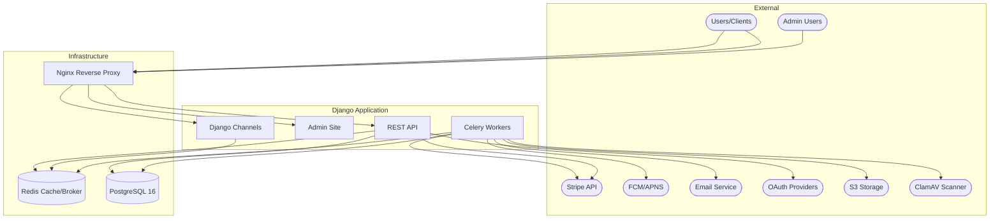
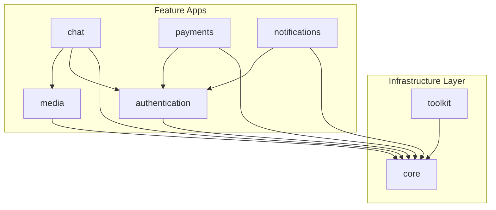

# Project Architecture

> Last generated: 2025-12-19 16:27 UTC

## Table of Contents

- [System Overview](#system-overview)
- [System Context](#system-context)
- [App Dependencies](#app-dependencies)
- [App Reference](#app-reference)
- [Quick Links](#quick-links)

---

## System Overview

This is a Django 5.2 LTS SaaS skeleton with pre-configured infrastructure for building production-ready applications. The project provides a comprehensive foundation including REST API (Django REST Framework), JWT authentication (dj-rest-auth + django-allauth), PostgreSQL 16, Redis, Celery for background tasks, WebSocket support via Django Channels, Stripe payment processing, AI provider integrations, and push notifications.

The architecture follows a clean separation between domain-agnostic infrastructure (`core/`) and business-aware utilities (`toolkit/`), with domain-specific logic organized into dedicated apps. All business logic lives in service classes that return `ServiceResult` objects, ensuring consistent error handling and testability.

Key architectural patterns include: state machines for payment entities, double-entry bookkeeping for financial tracking, soft deletion with audit trails, cursor-based pagination for large datasets, and Redis-based caching and presence tracking.

---

## System Context



---

## App Dependencies



Note: Arrows point from the dependent app TO the app it imports from.

---

## App Reference

| App | Models | Endpoints | Primary Responsibility |
|-----|--------|-----------|------------------------|
| [`core`](./core/ARCHITECTURE.md) | 0 | 0 | Domain-agnostic base classes, mixins, service patterns, exceptions |
| [`toolkit`](./toolkit/ARCHITECTURE.md) | 0 | 0 | Domain-aware SaaS utilities, protocols, decorators |
| [`authentication`](./authentication/ARCHITECTURE.md) | 4 | 17 | User management, JWT auth, social OAuth, biometric auth, profiles |
| [`chat`](./chat/ARCHITECTURE.md) | 6 | 30+ | Real-time messaging, conversations, reactions, presence, search |
| [`payments`](./payments/ARCHITECTURE.md) | 7 | 1 | Stripe integration, escrow, subscriptions, double-entry ledger |
| [`notifications`](./notifications/ARCHITECTURE.md) | 2 | 5 | Multi-channel notifications (push, email, WebSocket) |
| [`media`](./media/ARCHITECTURE.md) | 6 | 25+ | File uploads, storage, processing, sharing, tagging, search |

---

## Quick Links

### By Functionality

- **Authentication & Users:** [authentication](./authentication/ARCHITECTURE.md)
- **Real-time Messaging:** [chat](./chat/ARCHITECTURE.md)
- **Payments & Subscriptions:** [payments](./payments/ARCHITECTURE.md)
- **Notifications:** [notifications](./notifications/ARCHITECTURE.md)
- **File Management:** [media](./media/ARCHITECTURE.md)
- **Base Infrastructure:** [core](./core/ARCHITECTURE.md)
- **SaaS Utilities:** [toolkit](./toolkit/ARCHITECTURE.md)

### Key Entry Points

- API Root: `/api/v1/`
- Admin: `/admin/`
- Health Check: `/health/`

### API Namespaces

| Prefix | App | Description |
|--------|-----|-------------|
| `/api/v1/auth/` | authentication | Login, registration, profile, OAuth |
| `/api/v1/chat/` | chat | Conversations, messages, presence |
| `/api/v1/payments/` | payments | Stripe webhooks |
| `/api/v1/notifications/` | notifications | User notifications |
| `/api/v1/media/` | media | File upload, search, sharing |

### WebSocket Endpoints

| Path | App | Description |
|------|-----|-------------|
| `ws/chat/{conversation_id}/` | chat | Real-time chat messaging |
| `ws/notifications/` | notifications | Real-time notifications (stub) |

---

## Docker Services

| Service | Container | Purpose |
|---------|-----------|---------|
| web | app-web | Django + Uvicorn (port 8080) |
| db | app-db | PostgreSQL 16 |
| redis | app-redis | Cache + Celery broker + Channels layer |
| nginx | app-nginx | Reverse proxy (port 80) |
| celery-worker | app-celery-worker | Background tasks |
| celery-beat | app-celery-beat | Scheduled tasks |

---

## Core Patterns

### ServiceResult Pattern

All business logic returns `ServiceResult[T]` for consistent error handling:

```python
from core.services import BaseService, ServiceResult

class MyService(BaseService):
    @classmethod
    def do_action(cls, params) -> ServiceResult[MyModel]:
        if validation_fails:
            return ServiceResult.failure("Error message", error_code="ERROR_CODE")
        return ServiceResult.success(result_data)
```

### State Machine Pattern

Payment entities (PaymentOrder, Subscription, Payout, Refund) use state machine transitions:

```python
# Always use transition methods, never set state directly
order.process()  # PENDING -> PROCESSING
order.capture()  # PROCESSING -> CAPTURED
```

### Soft Delete Pattern

Models with `SoftDeleteMixin` preserve data for audit:

```python
class MyModel(SoftDeleteMixin, BaseModel):
    ...

# Soft delete (default)
instance.delete()  # Sets is_deleted=True, deleted_at=now()

# Hard delete
instance.delete(soft=False)  # Actually removes from database
```

---

## External Integrations

| Service | Package | Used By |
|---------|---------|---------|
| Stripe | `stripe` | payments |
| Firebase (FCM) | `firebase-admin` | notifications |
| Google OAuth | `django-allauth` | authentication |
| Apple Sign-In | `django-allauth` | authentication |
| AWS S3 | `boto3` | media |
| ClamAV | `clamd` | media |
| Redis | `django-redis` | core, chat, channels |
