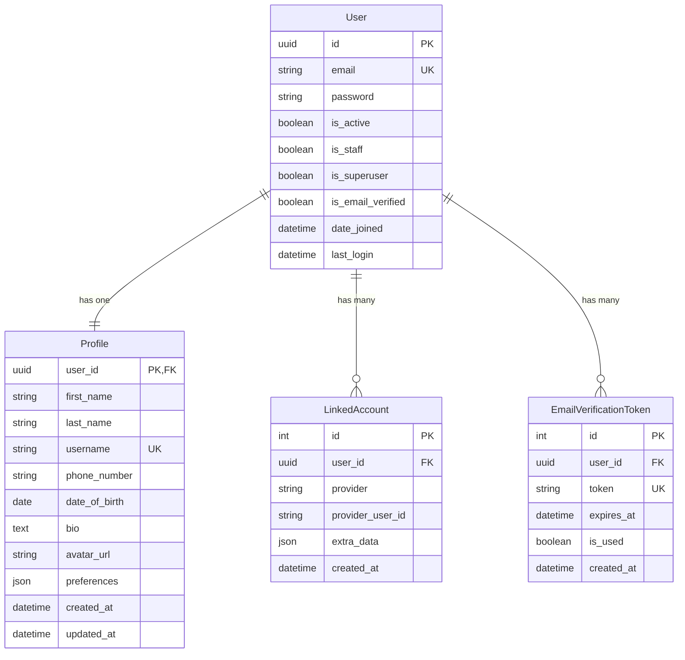
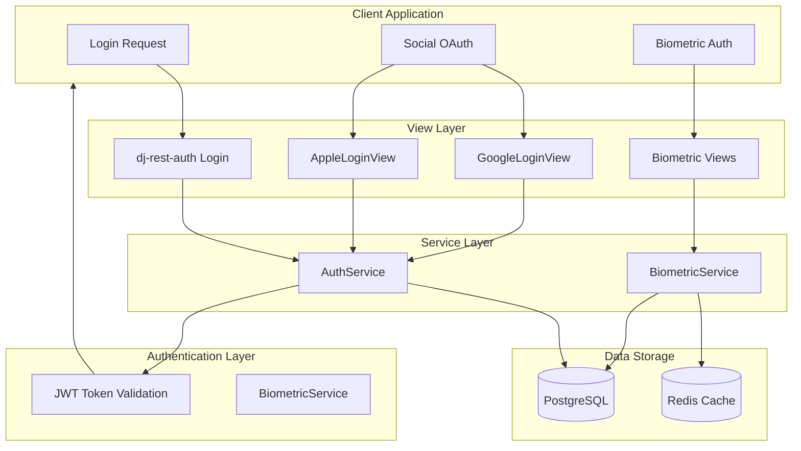
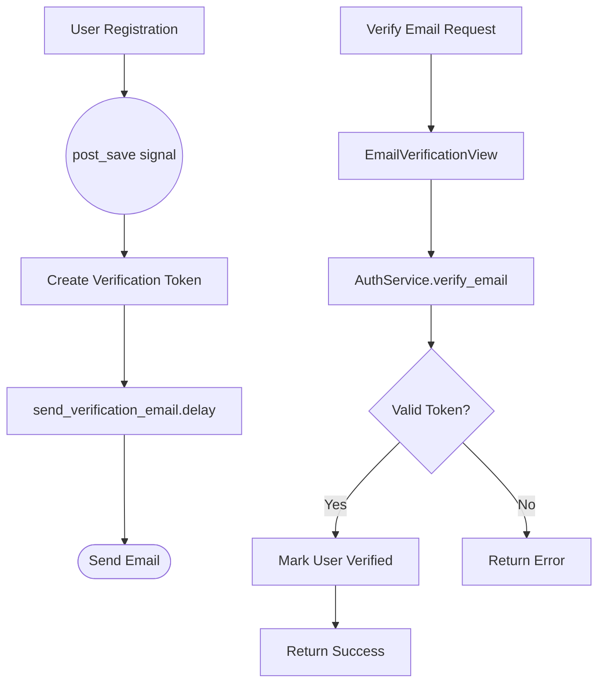

# Authentication Architecture

> Last generated: 2025-12-15 UTC

**Related Apps:** [core](../core/ARCHITECTURE.md) | [payments](../payments/ARCHITECTURE.md) | [notifications](../notifications/ARCHITECTURE.md) | [chat](../chat/ARCHITECTURE.md)

---

## Overview

The authentication app provides user management, authentication, and profile functionality. It implements email-based authentication (no username), social OAuth (Google, Apple), biometric authentication via ECDSA signatures, and user profile management.

### Dependencies

| Direction | Apps | Notes |
|-----------|------|-------|
| **Imports from** | `core` | BaseModel, BaseService, ServiceResult |
| **Imported by** | `payments`, `notifications`, `chat` | User model references |

### External Packages
- `dj-rest-auth` - JWT authentication endpoints
- `django-allauth` - Social OAuth providers
- `rest_framework_simplejwt` - JWT token handling
- `cryptography` - ECDSA biometric signatures
- `redis` - Challenge storage for biometric auth

---

## Data Models



### Model Details

| Model | Description |
|-------|-------------|
| **User** | Custom user model with UUID PK and email-only authentication (no username field) |
| **Profile** | Extended user information stored separately via OneToOne relationship |
| **LinkedAccount** | Social OAuth provider connections (Google, Apple) |
| **EmailVerificationToken** | Time-limited tokens for email verification |

---

## Component Flow

### Authentication Flow



### Email Verification Flow



### Biometric Authentication Flow

```mermaid
flowchart TD
    subgraph Enrollment
        E1[Request Enrollment] --> E2[Generate Challenge]
        E2 --> E3[Store Challenge in Redis]
        E3 --> E4[Return Challenge]
        E4 --> E5[Sign with Device Key]
        E5 --> E6[Submit Signature + Public Key]
        E6 --> E7[Verify Signature]
        E7 --> E8[Store Public Key]
    end

    subgraph Authentication
        A1[Request Challenge] --> A2[Generate Challenge]
        A2 --> A3[Store in Redis with TTL]
        A3 --> A4[Return Challenge]
        A4 --> A5[Sign with Device Key]
        A5 --> A6[Submit Signature]
        A6 --> A7[Verify Against Stored Key]
        A7 --> A8[Issue JWT Tokens]
    end
```



---

## External Interfaces

### API Endpoints

| Method | Path | View | Description |
|--------|------|------|-------------|
| POST | `/api/v1/auth/login/` | `dj-rest-auth` | Email/password login |
| POST | `/api/v1/auth/logout/` | `dj-rest-auth` | Logout (blacklist token) |
| POST | `/api/v1/auth/registration/` | `dj-rest-auth` | User registration |
| GET/PUT/PATCH | `/api/v1/auth/user/` | `dj-rest-auth` | Current user details |
| POST | `/api/v1/auth/password/reset/` | `dj-rest-auth` | Request password reset |
| POST | `/api/v1/auth/password/change/` | `dj-rest-auth` | Change password |
| GET/PUT/PATCH | `/api/v1/auth/profile/` | `ProfileView` | User profile CRUD |
| POST | `/api/v1/auth/verify-email/` | `EmailVerificationView` | Verify email with token |
| POST | `/api/v1/auth/resend-email/` | `ResendEmailView` | Resend verification email |
| POST | `/api/v1/auth/deactivate/` | `DeactivateAccountView` | Deactivate user account |
| POST | `/api/v1/auth/google/` | `GoogleLoginView` | Google OAuth2 login |
| POST | `/api/v1/auth/apple/` | `AppleLoginView` | Apple Sign-In login |
| POST | `/api/v1/auth/biometric/enroll/` | `BiometricEnrollView` | Start biometric enrollment |
| POST | `/api/v1/auth/biometric/challenge/` | `BiometricChallengeView` | Get auth challenge |
| POST | `/api/v1/auth/biometric/authenticate/` | `BiometricAuthenticateView` | Complete biometric auth |
| POST | `/api/v1/auth/biometric/disable/` | `BiometricDisableView` | Disable biometric auth |
| GET | `/api/v1/auth/biometric/status/` | `BiometricStatusView` | Check biometric status |

**URL Namespace:** `authentication`

### Signals Sent

| Signal | Sender | Trigger | Payload |
|--------|--------|---------|---------|
| `post_save` | `User` | User creation | `instance`, `created` |

### Signals Received

| Signal | Sender | Handler | Action |
|--------|--------|---------|--------|
| `post_save` | `User` | `create_user_profile` | Auto-create Profile on user creation |
| `post_save` | `User` | `send_email_verification` | Queue verification email |
| `user_signed_up` | `allauth` | `populate_profile_from_social` | Copy social data to Profile |

### Celery Tasks

| Task | Purpose | Schedule | Queue |
|------|---------|----------|-------|
| `send_verification_email` | Send email verification link | On demand | `default` |
| `send_password_reset_email` | Send password reset link | On demand | `default` |
| `send_welcome_email` | Send welcome email | On demand | `default` |
| `cleanup_expired_tokens` | Remove expired verification tokens | Daily | `maintenance` |
| `deactivate_unverified_accounts` | Deactivate old unverified accounts | Daily | `maintenance` |

---

## Service Layer

### AuthService

Handles user management operations:

```python
# Email verification
AuthService.create_verification_token(user) -> ServiceResult[EmailVerificationToken]
AuthService.verify_email(token) -> ServiceResult[User]
AuthService.resend_verification_email(email) -> ServiceResult[None]

# Password management
AuthService.request_password_reset(email) -> ServiceResult[None]
AuthService.reset_password(token, new_password) -> ServiceResult[User]

# Account management
AuthService.deactivate_account(user) -> ServiceResult[User]
```

### BiometricService

Handles ECDSA-based biometric authentication:

```python
# Enrollment
BiometricService.start_enrollment(user) -> ServiceResult[dict]
BiometricService.complete_enrollment(user, public_key, signature, challenge) -> ServiceResult[None]

# Authentication
BiometricService.create_challenge(user) -> ServiceResult[str]
BiometricService.verify_and_authenticate(user, signature, challenge) -> ServiceResult[dict]

# Management
BiometricService.is_enrolled(user) -> bool
BiometricService.disable(user) -> ServiceResult[None]
```

---

## Admin Configuration

| Model | Admin Class | Customizations |
|-------|-------------|----------------|
| `User` | `UserAdmin` | Custom fieldsets for email-only auth |
| `Profile` | `ProfileAdmin` | Inline with User |
| `LinkedAccount` | `LinkedAccountAdmin` | Read-only provider info |
| `EmailVerificationToken` | Default | Token management |
