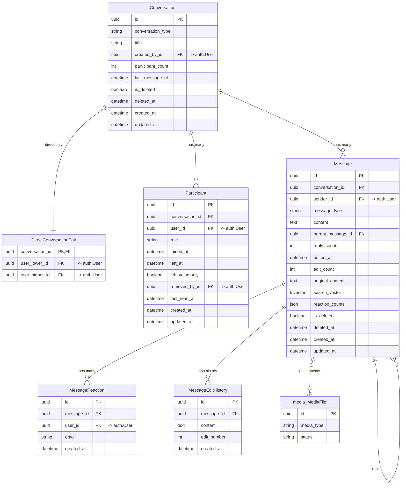
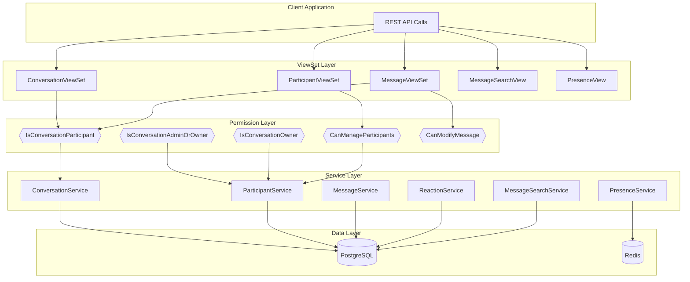
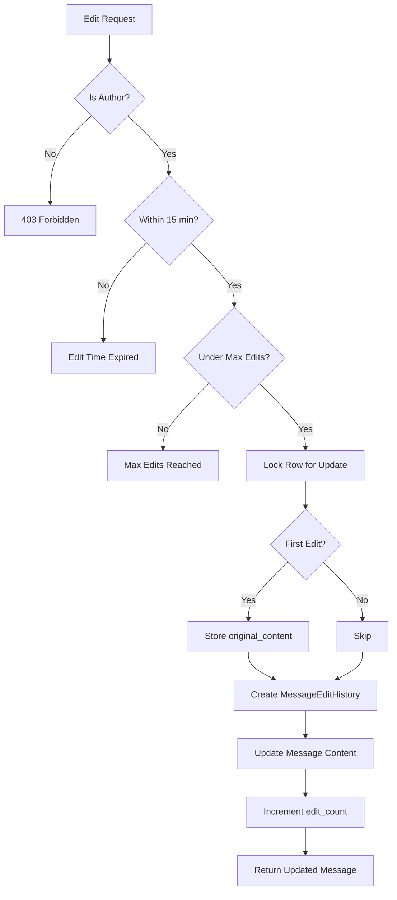
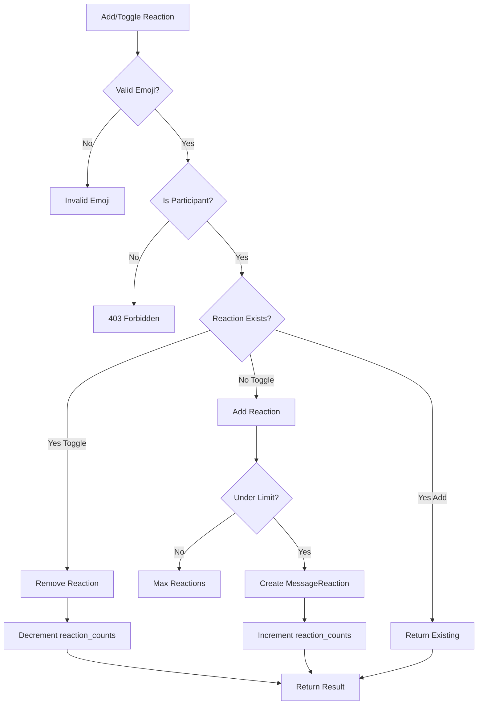
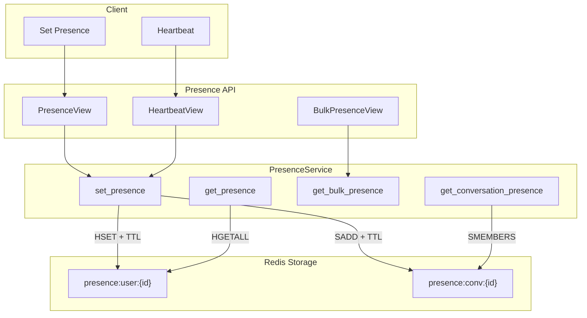
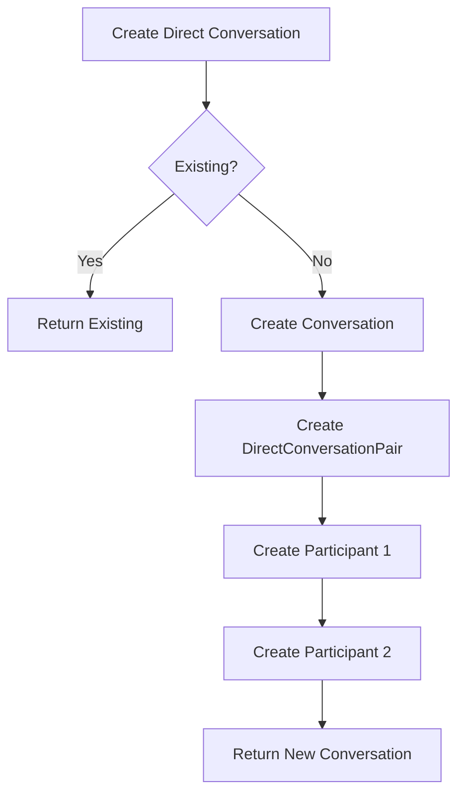
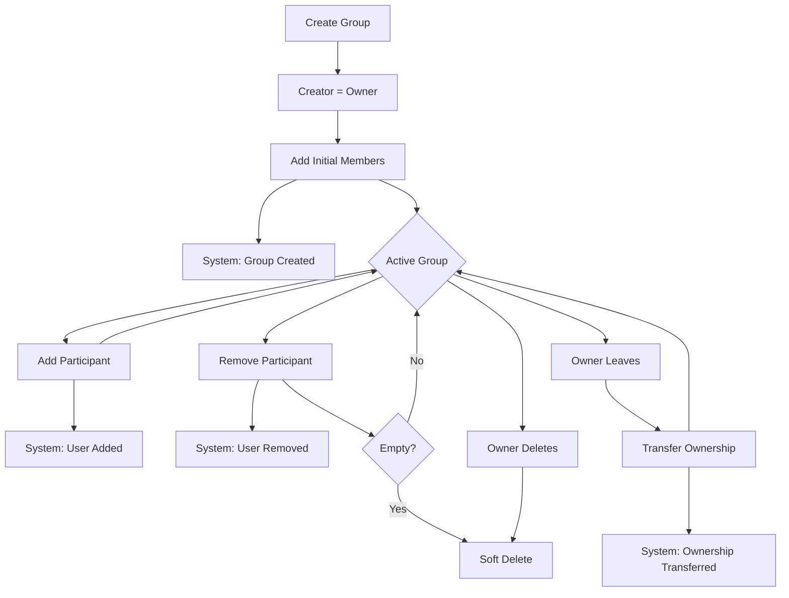
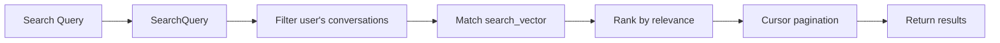

# Chat Architecture

> Last generated: 2025-12-19 16:27 UTC

**Related Apps:** [core](../core/ARCHITECTURE.md) | [authentication](../authentication/ARCHITECTURE.md) | [media](../media/ARCHITECTURE.md)

---

## Overview

The chat app provides real-time messaging functionality supporting direct (1:1) conversations and group conversations with role-based permissions. It uses Django Channels for WebSocket communication and implements soft deletion for messages with full audit trail preservation.

Key features include message editing with history, emoji reactions, full-text search with PostgreSQL, Redis-based presence tracking, and media attachments via the media app.

### Dependencies

| Direction | Apps | Notes |
|-----------|------|-------|
| **Imports from** | `core` | BaseModel, SoftDeleteMixin, BaseService, ServiceResult |
| **Imports from** | `authentication` | User model for participants/senders |
| **Imports from** | `media` | MediaFile for message attachments |
| **Imported by** | None | Standalone chat system |

### External Packages
- `channels` - WebSocket support (ASGI)
- `channels_redis` - Redis channel layer backend
- `django-redis` - Redis cache for presence tracking
- `rest_framework_simplejwt` - JWT authentication for WebSocket

---

## Data Models



### Conversation Types

| Type | Description | Membership | Roles |
|------|-------------|------------|-------|
| `DIRECT` | 1:1 conversation | Immutable (exactly 2) | None |
| `GROUP` | Multi-user conversation | Mutable (2+) | Owner, Admin, Member |

### Participant Roles

| Role | Permissions |
|------|-------------|
| `OWNER` | Full control: remove admins, demote, transfer ownership, delete conversation |
| `ADMIN` | Can add participants, remove members, change title |
| `MEMBER` | Can send messages, delete own messages, leave |

---

## Component Flow

### REST API Flow



### WebSocket Flow

```mermaid
flowchart TD
    subgraph Client["Client Application"]
        WS[WebSocket Connection]
    end

    subgraph Middleware["Auth Middleware"]
        JWT[JWTAuthMiddlewareStack]
    end

    subgraph Consumer["ChatConsumer"]
        Connect[connect]
        Receive[receive_json]
        Handlers[Message Handlers]
    end

    subgraph ChannelLayer["Redis Channel Layer"]
        Group[chat_{conversation_id}]
    end

    subgraph Broadcast["Group Broadcast"]
        ChatMessage[chat.message]
        ChatTyping[chat.typing]
    end

    WS --> JWT
    JWT --> Connect
    Connect --> |Validate| Group
    WS --> Receive
    Receive --> Handlers
    Handlers --> Group
    Group --> ChatMessage
    Group --> ChatTyping
    ChatMessage --> Client
    ChatTyping --> Client
```

### Message Editing Flow



### Reaction Flow



### Presence Tracking Flow



### Direct Conversation Creation



### Group Conversation Lifecycle



---

## External Interfaces

### REST API Endpoints

| Method | Path | View | Description |
|--------|------|------|-------------|
| GET | `/api/v1/chat/conversations/` | `ConversationViewSet.list` | List user's conversations |
| POST | `/api/v1/chat/conversations/` | `ConversationViewSet.create` | Create conversation |
| GET | `/api/v1/chat/conversations/{id}/` | `ConversationViewSet.retrieve` | Get conversation detail |
| PATCH | `/api/v1/chat/conversations/{id}/` | `ConversationViewSet.partial_update` | Update group title |
| DELETE | `/api/v1/chat/conversations/{id}/` | `ConversationViewSet.destroy` | Delete group (owner only) |
| POST | `/api/v1/chat/conversations/{id}/read/` | `ConversationViewSet.read` | Mark as read |
| POST | `/api/v1/chat/conversations/{id}/leave/` | `ConversationViewSet.leave` | Leave conversation |
| POST | `/api/v1/chat/conversations/{id}/transfer-ownership/` | `ConversationViewSet.transfer_ownership` | Transfer ownership |
| GET | `/api/v1/chat/conversations/{id}/presence/` | `ConversationViewSet.presence` | Get conversation presence |
| GET | `/api/v1/chat/conversations/{id}/participants/` | `ParticipantViewSet.list` | List participants |
| POST | `/api/v1/chat/conversations/{id}/participants/` | `ParticipantViewSet.create` | Add participant |
| PATCH | `/api/v1/chat/conversations/{id}/participants/{pk}/` | `ParticipantViewSet.partial_update` | Change role |
| DELETE | `/api/v1/chat/conversations/{id}/participants/{pk}/` | `ParticipantViewSet.destroy` | Remove participant |
| GET | `/api/v1/chat/conversations/{id}/messages/` | `MessageViewSet.list` | List messages |
| POST | `/api/v1/chat/conversations/{id}/messages/` | `MessageViewSet.create` | Send message |
| DELETE | `/api/v1/chat/conversations/{id}/messages/{pk}/` | `MessageViewSet.destroy` | Delete message |
| PATCH | `/api/v1/chat/conversations/{id}/messages/{pk}/edit/` | `MessageViewSet.edit` | Edit message |
| GET | `/api/v1/chat/conversations/{id}/messages/{pk}/history/` | `MessageViewSet.history` | Get edit history |
| GET | `/api/v1/chat/conversations/{id}/messages/{pk}/reactions/` | `MessageViewSet.reactions` | List reactions |
| POST | `/api/v1/chat/conversations/{id}/messages/{pk}/reactions/` | `MessageViewSet.reactions` | Add reaction |
| DELETE | `/api/v1/chat/conversations/{id}/messages/{pk}/reactions/{emoji}/` | `MessageViewSet.remove_reaction` | Remove reaction |
| POST | `/api/v1/chat/conversations/{id}/messages/{pk}/reactions/toggle/` | `MessageViewSet.toggle_reaction` | Toggle reaction |
| GET | `/api/v1/chat/messages/search/` | `MessageSearchView` | Full-text search |
| POST | `/api/v1/chat/presence/` | `PresenceView` | Set presence status |
| GET | `/api/v1/chat/presence/{user_id}/` | `UserPresenceView` | Get user presence |
| POST | `/api/v1/chat/presence/bulk/` | `BulkPresenceView` | Get bulk presence |
| POST | `/api/v1/chat/presence/heartbeat/` | `HeartbeatView` | Send heartbeat |

**URL Namespace:** `chat`

### WebSocket Endpoints

| Path | Consumer | Description |
|------|----------|-------------|
| `ws/chat/{conversation_id}/` | `ChatConsumer` | Real-time chat connection |

### WebSocket Message Types

**Client to Server:**

| Type | Payload | Description |
|------|---------|-------------|
| `message` | `{content: string, parent_id?: int}` | Send new message |
| `typing` | `{is_typing: boolean}` | Typing indicator |

**Server to Client:**

| Type | Payload | Description |
|------|---------|-------------|
| `message` | `{id, sender_id, content, ...}` | New message received |
| `typing` | `{user_id, is_typing}` | User typing status |
| `error` | `{message}` | Error response |

---

## Service Layer

### ConversationService

```python
ConversationService.create_direct(user1, user2) -> ServiceResult[Conversation]
ConversationService.create_group(creator, title, initial_members) -> ServiceResult[Conversation]
ConversationService.update_title(conversation, user, new_title) -> ServiceResult[Conversation]
ConversationService.delete_conversation(conversation, user) -> ServiceResult[None]
```

### ParticipantService

```python
ParticipantService.add_participant(conversation, user_to_add, added_by, role) -> ServiceResult[Participant]
ParticipantService.remove_participant(conversation, user_to_remove, removed_by) -> ServiceResult[None]
ParticipantService.change_role(conversation, user_to_change, new_role, changed_by) -> ServiceResult[Participant]
ParticipantService.leave(conversation, user) -> ServiceResult[None]
ParticipantService.transfer_ownership(conversation, new_owner, current_owner) -> ServiceResult[None]
```

### MessageService

```python
MessageService.send_message(conversation, sender, content, parent_message_id) -> ServiceResult[Message]
MessageService.delete_message(message, user) -> ServiceResult[None]
MessageService.edit_message(user, message_id, new_content) -> ServiceResult[Message]
MessageService.get_edit_history(user, message_id) -> ServiceResult[list[MessageEditHistory]]
MessageService.mark_as_read(conversation, user) -> ServiceResult[None]
MessageService.get_unread_count(conversation, user) -> int
```

### ReactionService

```python
ReactionService.add_reaction(user, message_id, emoji) -> ServiceResult[MessageReaction]
ReactionService.remove_reaction(user, message_id, emoji) -> ServiceResult[None]
ReactionService.toggle_reaction(user, message_id, emoji) -> ServiceResult[tuple[bool, MessageReaction | None]]
ReactionService.get_message_reactions(message_id) -> ServiceResult[dict]
ReactionService.get_user_reactions(user, message_ids) -> ServiceResult[dict[int, list[str]]]
```

### MessageSearchService

```python
MessageSearchService.search(user, query, conversation_id?, cursor?, page_size?) -> ServiceResult[dict]
```

### PresenceService

```python
PresenceService.set_presence(user_id, status, conversation_id?) -> ServiceResult
PresenceService.get_presence(user_id) -> ServiceResult
PresenceService.get_bulk_presence(user_ids) -> ServiceResult
PresenceService.get_conversation_presence(conversation_id) -> ServiceResult
PresenceService.heartbeat(user_id, conversation_id?) -> ServiceResult
PresenceService.leave_conversation(user_id, conversation_id) -> ServiceResult
PresenceService.clear_presence(user_id) -> ServiceResult
```

---

## Configuration

### MESSAGE_CONFIG

| Setting | Value | Description |
|---------|-------|-------------|
| `MAX_CONTENT_LENGTH` | 10000 | Maximum message characters |
| `EDIT_TIME_LIMIT_SECONDS` | 900 | 15 minute edit window |
| `MAX_EDIT_COUNT` | 10 | Maximum edits per message |
| `PRESERVE_ORIGINAL_CONTENT` | True | Store original on first edit |
| `SEARCH_MIN_QUERY_LENGTH` | 2 | Minimum search query length |
| `SEARCH_MAX_RESULTS` | 100 | Maximum search results |
| `SEARCH_DEFAULT_PAGE_SIZE` | 20 | Default search page size |

### REACTION_CONFIG

| Setting | Value | Description |
|---------|-------|-------------|
| `MAX_REACTIONS_PER_MESSAGE` | 20 | Total unique emojis per message |
| `MAX_USER_REACTIONS_PER_MESSAGE` | 5 | Max reactions from one user |
| `MAX_EMOJI_LENGTH` | 8 | Max characters per emoji |
| `ALLOWED_EMOJIS` | None | Restrict to specific emojis (None = any) |
| `QUICK_REACTIONS` | Tuple | UI suggestions for quick reactions |

### PRESENCE_CONFIG

| Setting | Value | Description |
|---------|-------|-------------|
| `PRESENCE_TTL_SECONDS` | 60 | User presence expiration |
| `CONVERSATION_PRESENCE_TTL_SECONDS` | 30 | Conversation presence expiration |
| `HEARTBEAT_INTERVAL_SECONDS` | 30 | Recommended client heartbeat interval |

### ATTACHMENT_CONFIG

| Setting | Value | Description |
|---------|-------|-------------|
| `MAX_ATTACHMENTS_PER_MESSAGE` | 10 | Maximum files per message |
| `ALLOWED_MEDIA_TYPES` | image, video, document, audio | Allowed MediaFile types |
| `DEFAULT_VISIBILITY` | private | Only participants can access |

---

## System Messages

System messages are stored as JSON in the content field:

```json
{
    "event": "participant_added",
    "data": {
        "user_id": "uuid",
        "added_by_id": "uuid"
    }
}
```

### Event Types

| Event | Description | Data Fields |
|-------|-------------|-------------|
| `group_created` | Group was created | `title` |
| `participant_added` | User was added | `user_id`, `added_by_id` |
| `participant_removed` | User left/removed | `user_id`, `removed_by_id`, `reason` |
| `role_changed` | Role was changed | `user_id`, `old_role`, `new_role`, `changed_by_id` |
| `ownership_transferred` | Ownership changed | `from_user_id`, `to_user_id`, `reason` |
| `title_changed` | Title was changed | `old_title`, `new_title`, `changed_by_id` |

---

## Threading Model

Messages support single-level threading:

```
Root Message (parent_message=null, reply_count=2)
├── Reply 1 (parent_message=root)
└── Reply 2 (parent_message=root)
    └── Reply to Reply (parent_message=root, NOT reply_2)
```

When replying to a reply, the service automatically normalizes to reference the root message.

---

## Full-Text Search

The chat app uses PostgreSQL full-text search for message content:

1. **search_vector Field**: Each Message has a `SearchVectorField` storing preprocessed text
2. **Database Trigger**: A PostgreSQL trigger automatically updates `search_vector` on insert/update
3. **GIN Index**: The `search_vector` field is indexed with a GIN index for fast lookups
4. **English Configuration**: Uses English stemming and stop word removal
5. **Relevance Ranking**: Results are ranked by `SearchRank` relevance score



---

## Presence System

Redis-based real-time presence tracking:

### Status Values

| Status | Description |
|--------|-------------|
| `online` | User is active |
| `away` | User is idle |
| `offline` | User is disconnected |

### Redis Key Structure

| Key Pattern | Type | TTL | Content |
|-------------|------|-----|---------|
| `presence:user:{user_id}` | Hash | 60s | `{status, last_seen}` |
| `presence:conv:{conv_id}` | Set | 30s | User IDs currently viewing |

### Lua Scripts

Atomic operations using Lua scripts:
- **LUA_SET_PRESENCE**: Atomically set user presence with TTL
- **LUA_SET_CONVERSATION_PRESENCE**: Atomically add user to conversation set with TTL

---

## Soft Delete Behavior

### Messages

- `is_deleted=True`: Content replaced with "[Message deleted]" in API responses
- Original content preserved in database for audit
- Message still counts toward unread count
- Sender information remains visible

### Conversations

- `is_deleted=True`: Conversation archived but data preserved
- Participants can still access historical messages
- Direct conversations deleted when both users leave
- Group conversations deleted when empty or by owner

---

## Authorization

### ChatAuthorizationService

Stateless service providing authorization checks:

```python
ChatAuthorizationService.is_conversation_participant(user, conversation_id) -> bool
ChatAuthorizationService.is_message_author(user, message_id) -> bool
ChatAuthorizationService.can_access_message(user, message_id) -> tuple[bool, Message | None]
ChatAuthorizationService.get_user_conversation_ids(user) -> list[int]
ChatAuthorizationService.get_participant_role(user, conversation_id) -> str | None
```

### Decorators

```python
@require_conversation_participant(conversation_id_param="conversation_id", user_param="user")
@require_message_access(message_id_param="message_id", user_param="user")
```

---

## Pagination

### MessageCursorPagination

- **Default page size**: 50 messages
- **Maximum page size**: 100 messages
- **Ordering**: `created_at, id` (oldest first)

### ConversationCursorPagination

- **Default page size**: 20 conversations
- **Maximum page size**: 50 conversations
- **Ordering**: `-last_message_at, -created_at, -id` (most recent first)
