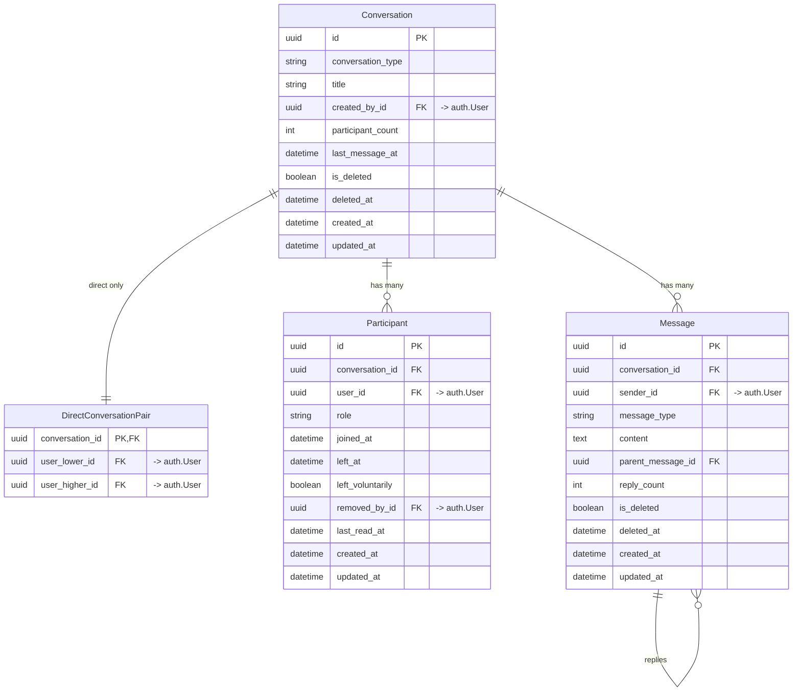
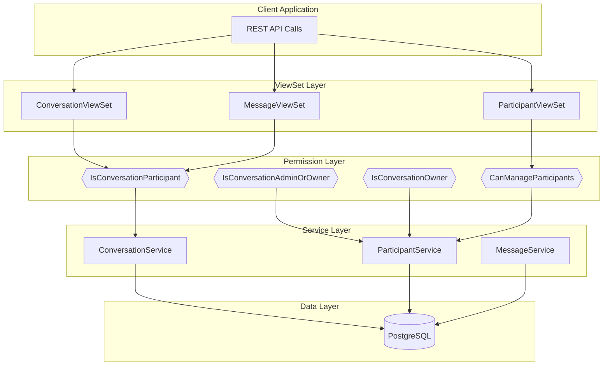
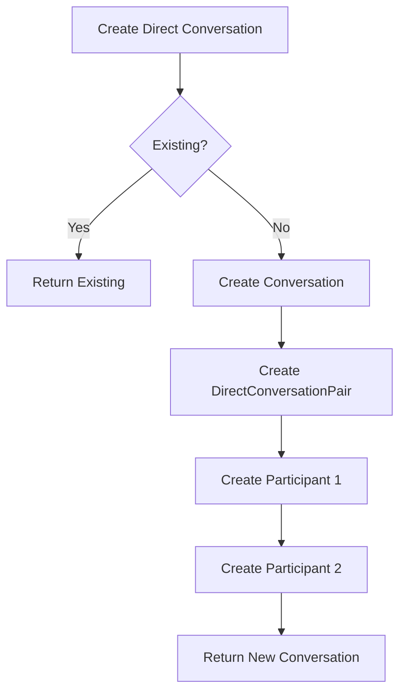
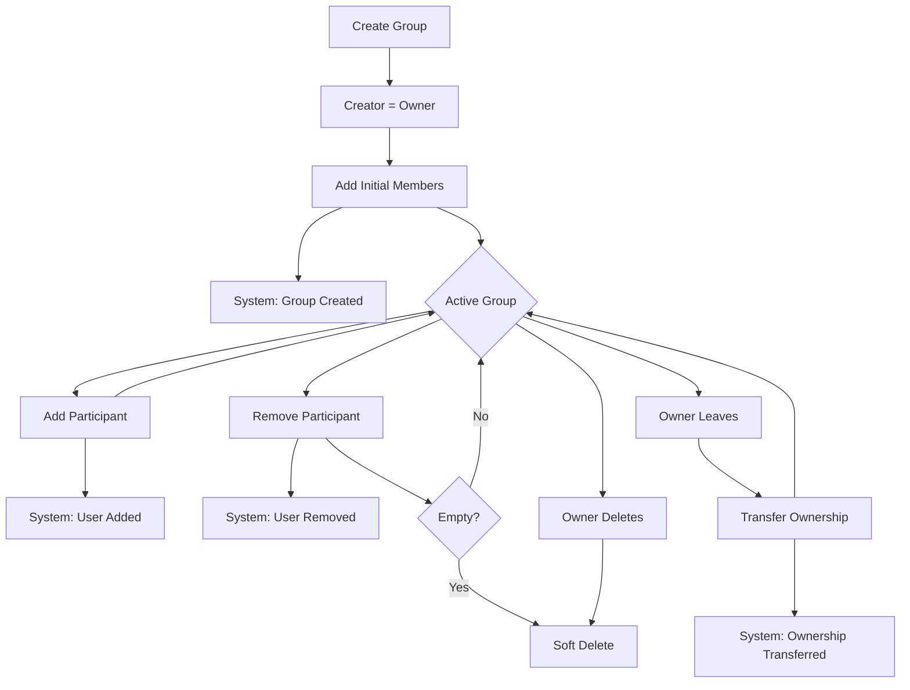

# Chat Architecture

> Last generated: 2025-12-15 UTC

**Related Apps:** [core](../core/ARCHITECTURE.md) | [authentication](../authentication/ARCHITECTURE.md)

---

## Overview

The chat app provides real-time messaging functionality supporting direct (1:1) conversations and group conversations with role-based permissions. It uses Django Channels for WebSocket communication and implements soft deletion for messages with full audit trail preservation.

### Dependencies

| Direction | Apps | Notes |
|-----------|------|-------|
| **Imports from** | `core` | BaseModel, SoftDeleteMixin, BaseService, ServiceResult |
| **Imports from** | `authentication` | User model for participants/senders |
| **Imported by** | None | Standalone chat system |

### External Packages
- `channels` - WebSocket support (ASGI)
- `channels_redis` - Redis channel layer backend
- `rest_framework_simplejwt` - JWT authentication for WebSocket

---

## Data Models



### Conversation Types

| Type | Description | Membership | Roles |
|------|-------------|------------|-------|
| `DIRECT` | 1:1 conversation | Immutable (exactly 2) | None |
| `GROUP` | Multi-user conversation | Mutable (2+) | Owner, Admin, Member |

### Participant Roles

| Role | Permissions |
|------|-------------|
| `OWNER` | Full control: remove admins, demote, transfer ownership, delete conversation |
| `ADMIN` | Can add participants, remove members, change title |
| `MEMBER` | Can send messages, delete own messages, leave |

---

## Component Flow

### REST API Flow



### WebSocket Flow

```mermaid
flowchart TD
    subgraph Client["Client Application"]
        WS[WebSocket Connection]
    end

    subgraph Middleware["Auth Middleware"]
        JWT[JWTAuthMiddlewareStack]
    end

    subgraph Consumer["ChatConsumer"]
        Connect[connect]
        Receive[receive_json]
        Handlers[Message Handlers]
    end

    subgraph ChannelLayer["Redis Channel Layer"]
        Group[chat_{conversation_id}]
    end

    subgraph Broadcast["Group Broadcast"]
        ChatMessage[chat.message]
        ChatTyping[chat.typing]
    end

    WS --> JWT
    JWT --> Connect
    Connect --> |Validate| Group
    WS --> Receive
    Receive --> Handlers
    Handlers --> Group
    Group --> ChatMessage
    Group --> ChatTyping
    ChatMessage --> Client
    ChatTyping --> Client
```

### Direct Conversation Creation



### Group Conversation Lifecycle



---

## External Interfaces

### REST API Endpoints

| Method | Path | View | Description |
|--------|------|------|-------------|
| GET | `/api/v1/chat/conversations/` | `ConversationViewSet.list` | List user's conversations |
| POST | `/api/v1/chat/conversations/` | `ConversationViewSet.create` | Create conversation |
| GET | `/api/v1/chat/conversations/{id}/` | `ConversationViewSet.retrieve` | Get conversation detail |
| PATCH | `/api/v1/chat/conversations/{id}/` | `ConversationViewSet.partial_update` | Update group title |
| DELETE | `/api/v1/chat/conversations/{id}/` | `ConversationViewSet.destroy` | Delete group (owner only) |
| POST | `/api/v1/chat/conversations/{id}/read/` | `ConversationViewSet.read` | Mark as read |
| POST | `/api/v1/chat/conversations/{id}/leave/` | `ConversationViewSet.leave` | Leave conversation |
| POST | `/api/v1/chat/conversations/{id}/transfer-ownership/` | `ConversationViewSet.transfer_ownership` | Transfer ownership |
| GET | `/api/v1/chat/conversations/{id}/participants/` | `ParticipantViewSet.list` | List participants |
| POST | `/api/v1/chat/conversations/{id}/participants/` | `ParticipantViewSet.create` | Add participant |
| PATCH | `/api/v1/chat/conversations/{id}/participants/{pk}/` | `ParticipantViewSet.partial_update` | Change role |
| DELETE | `/api/v1/chat/conversations/{id}/participants/{pk}/` | `ParticipantViewSet.destroy` | Remove participant |
| GET | `/api/v1/chat/conversations/{id}/messages/` | `MessageViewSet.list` | List messages |
| POST | `/api/v1/chat/conversations/{id}/messages/` | `MessageViewSet.create` | Send message |
| DELETE | `/api/v1/chat/conversations/{id}/messages/{pk}/` | `MessageViewSet.destroy` | Delete message |

**URL Namespace:** `chat`

### WebSocket Endpoints

| Path | Consumer | Description |
|------|----------|-------------|
| `ws/chat/{conversation_id}/` | `ChatConsumer` | Real-time chat connection |

### WebSocket Message Types

**Client to Server:**

| Type | Payload | Description |
|------|---------|-------------|
| `message` | `{content: string, parent_id?: int}` | Send new message |
| `typing` | `{is_typing: boolean}` | Typing indicator |

**Server to Client:**

| Type | Payload | Description |
|------|---------|-------------|
| `message` | `{id, sender_id, content, ...}` | New message received |
| `typing` | `{user_id, is_typing}` | User typing status |
| `error` | `{message}` | Error response |

---

## Service Layer

### ConversationService

```python
ConversationService.create_direct(user1, user2) -> ServiceResult[Conversation]
ConversationService.create_group(creator, title, initial_members) -> ServiceResult[Conversation]
ConversationService.update_title(conversation, user, new_title) -> ServiceResult[Conversation]
ConversationService.delete_conversation(conversation, user) -> ServiceResult[None]
```

### ParticipantService

```python
ParticipantService.add_participant(conversation, user_to_add, added_by, role) -> ServiceResult[Participant]
ParticipantService.remove_participant(conversation, user_to_remove, removed_by) -> ServiceResult[None]
ParticipantService.change_role(conversation, user_to_change, new_role, changed_by) -> ServiceResult[Participant]
ParticipantService.leave(conversation, user) -> ServiceResult[None]
ParticipantService.transfer_ownership(conversation, new_owner, current_owner) -> ServiceResult[Participant]
```

### MessageService

```python
MessageService.send_message(conversation, sender, content, parent_message_id) -> ServiceResult[Message]
MessageService.delete_message(message, user) -> ServiceResult[None]
MessageService.mark_as_read(conversation, user) -> ServiceResult[Participant]
```

---

## System Messages

System messages are stored as JSON in the content field:

```json
{
    "event": "participant_added",
    "data": {
        "user_id": "uuid",
        "added_by_id": "uuid"
    }
}
```

### Event Types

| Event | Description | Data Fields |
|-------|-------------|-------------|
| `group_created` | Group was created | `title` |
| `participant_added` | User was added | `user_id`, `added_by_id` |
| `participant_removed` | User left/removed | `user_id`, `removed_by_id`, `reason` |
| `role_changed` | Role was changed | `user_id`, `old_role`, `new_role`, `changed_by_id` |
| `ownership_transferred` | Ownership changed | `from_user_id`, `to_user_id`, `reason` |
| `title_changed` | Title was changed | `old_title`, `new_title`, `changed_by_id` |

---

## Threading Model

Messages support single-level threading:

```
Root Message (parent_message=null, reply_count=2)
├── Reply 1 (parent_message=root)
└── Reply 2 (parent_message=root)
    └── Reply to Reply (parent_message=root, NOT reply_2)
```

When replying to a reply, the service automatically normalizes to reference the root message.

---

## Soft Delete Behavior

### Messages

- `is_deleted=True`: Content replaced with "[Message deleted]" in API responses
- Original content preserved in database for audit
- Message still counts toward unread count
- Sender information remains visible

### Conversations

- `is_deleted=True`: Conversation archived but data preserved
- Participants can still access historical messages
- Direct conversations deleted when both users leave
- Group conversations deleted when empty or by owner
