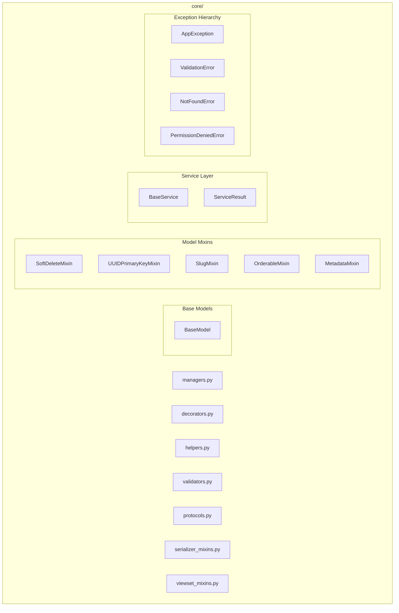
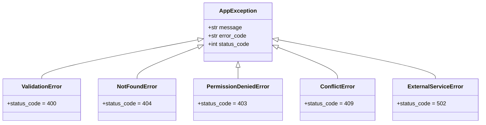

# Core Architecture

> Last generated: 2025-12-15 UTC

**Related Apps:** [authentication](../authentication/ARCHITECTURE.md) | [payments](../payments/ARCHITECTURE.md) | [notifications](../notifications/ARCHITECTURE.md) | [chat](../chat/ARCHITECTURE.md)

---

## Overview

The core module provides domain-agnostic infrastructure code that can be reused across any Django application. It includes base models, mixins, service patterns, exception hierarchies, and generic utilities. This module has no knowledge of the application's business domain.

### Design Philosophy

Code in `core/` must pass this test: "Would this code make sense in a completely different application (e-commerce, social network, CRM)?"

- **Yes**: It belongs in `core/`
- **No**: It belongs in `toolkit/` or a domain app

### Dependencies

| Direction | Apps | Notes |
|-----------|------|-------|
| **Imports from** | None | No dependencies on other apps |
| **Imported by** | All apps | Base classes and utilities |

---

## Module Structure



---

## Base Models

### BaseModel

Abstract base model providing timestamps and default ordering:

```python
class BaseModel(models.Model):
    created_at = models.DateTimeField(auto_now_add=True, db_index=True)
    updated_at = models.DateTimeField(auto_now=True)

    class Meta:
        abstract = True
        ordering = ["-created_at"]
```

---

## Model Mixins

### UUIDPrimaryKeyMixin

Replaces integer primary key with UUID:

```python
class UUIDPrimaryKeyMixin(models.Model):
    id = models.UUIDField(primary_key=True, default=uuid.uuid4, editable=False)

    class Meta:
        abstract = True
```

### SoftDeleteMixin

Enables soft deletion with timestamp:

```python
class SoftDeleteMixin(models.Model):
    is_deleted = models.BooleanField(default=False, db_index=True)
    deleted_at = models.DateTimeField(null=True, blank=True)

    def delete(self, soft=True, *args, **kwargs):
        if soft:
            self.is_deleted = True
            self.deleted_at = timezone.now()
            self.save()
        else:
            super().delete(*args, **kwargs)

    class Meta:
        abstract = True
```

### SlugMixin

Adds unique slug field:

```python
class SlugMixin(models.Model):
    slug = models.SlugField(max_length=100, unique=True, db_index=True)

    class Meta:
        abstract = True
```

### OrderableMixin

Enables manual ordering:

```python
class OrderableMixin(models.Model):
    order = models.PositiveIntegerField(default=0, db_index=True)

    class Meta:
        abstract = True
        ordering = ["order"]
```

### MetadataMixin

Adds JSON metadata field:

```python
class MetadataMixin(models.Model):
    metadata = models.JSONField(default=dict, blank=True)

    class Meta:
        abstract = True
```

---

## Service Layer

### ServiceResult

Generic result wrapper for service method returns:

```python
@dataclass
class ServiceResult(Generic[T]):
    success: bool
    data: T | None = None
    error: str | None = None
    error_code: str | None = None

    @classmethod
    def success(cls, data: T) -> "ServiceResult[T]":
        return cls(success=True, data=data)

    @classmethod
    def failure(cls, error: str, error_code: str = None) -> "ServiceResult[T]":
        return cls(success=False, error=error, error_code=error_code)
```

### BaseService

Abstract base class for service layer:

```python
class BaseService:
    @classmethod
    def get_logger(cls) -> logging.Logger:
        return logging.getLogger(cls.__name__)

    @classmethod
    @contextmanager
    def atomic(cls):
        with transaction.atomic():
            yield
```

### Usage Pattern

```python
from core.services import BaseService, ServiceResult

class UserService(BaseService):
    @classmethod
    def create_user(cls, email: str, password: str) -> ServiceResult[User]:
        try:
            with cls.atomic():
                user = User.objects.create_user(email=email, password=password)
                return ServiceResult.success(user)
        except IntegrityError:
            return ServiceResult.failure(
                "Email already exists",
                error_code="DUPLICATE_EMAIL"
            )
```

---

## Exception Hierarchy



### Exception Classes

| Exception | Status Code | Use Case |
|-----------|-------------|----------|
| `ValidationError` | 400 | Invalid input data |
| `NotFoundError` | 404 | Resource not found |
| `PermissionDeniedError` | 403 | Insufficient permissions |
| `ConflictError` | 409 | State conflict (e.g., duplicate) |
| `ExternalServiceError` | 502 | Third-party service failure |

---

## Decorators

### rate_limit

Rate limiting decorator with Redis backend:

```python
@rate_limit(key="api", limit=100, period=3600)
def api_endpoint(request):
    ...
```

### cache_response

Response caching decorator:

```python
@cache_response(timeout=300, key_prefix="users")
def get_users(request):
    ...
```

### log_request

Request logging decorator:

```python
@log_request(include_body=False)
def sensitive_endpoint(request):
    ...
```

---

## Helpers

### Token Generation

```python
from core.helpers import generate_token, hash_string

token = generate_token(32)  # Cryptographically secure random token
hashed = hash_string("password", algorithm="sha256")
```

### Validation Utilities

```python
from core.helpers import validate_uuid, get_client_ip

is_valid = validate_uuid("550e8400-e29b-41d4-a716-446655440000")
ip = get_client_ip(request)  # Handles X-Forwarded-For
```

### Pagination

```python
from core.helpers import calculate_pagination

pagination = calculate_pagination(
    total_items=100,
    page=2,
    page_size=20
)
# Returns: {"page": 2, "page_size": 20, "total_pages": 5, "has_next": True, ...}
```

---

## Validators

### File Validators

```python
from core.validators import validate_file_size, validate_file_extension

# In model field
avatar = models.ImageField(
    validators=[
        validate_file_size(max_mb=5),
        validate_file_extension(allowed=[".jpg", ".png"]),
    ]
)
```

### Content Validators

```python
from core.validators import validate_no_html, validate_json_schema

# Prevent XSS in text fields
bio = models.TextField(validators=[validate_no_html])

# Validate JSON structure
config = models.JSONField(validators=[validate_json_schema(schema)])
```

---

## Protocols

### CacheBackend

Interface for cache implementations:

```python
from core.protocols import CacheBackend

class RedisCache:
    def get(self, key: str) -> Any | None: ...
    def set(self, key: str, value: Any, timeout: int = None) -> None: ...
    def delete(self, key: str) -> None: ...

def get_data(cache: CacheBackend, key: str):
    return cache.get(key)
```

---

## ViewSet Mixins

### PaginationMixin

Standard pagination behavior:

```python
class MyViewSet(PaginationMixin, viewsets.ModelViewSet):
    ...
```

### BulkActionMixin

Bulk operations support:

```python
class MyViewSet(BulkActionMixin, viewsets.ModelViewSet):
    @action(detail=False, methods=["post"])
    def bulk_delete(self, request):
        return self.perform_bulk_action(request, "delete")
```

### SoftDeleteViewSetMixin

Soft delete support in viewsets:

```python
class MyViewSet(SoftDeleteViewSetMixin, viewsets.ModelViewSet):
    def get_queryset(self):
        return super().get_queryset().filter(is_deleted=False)
```

---

## Serializer Mixins

### TimestampMixin

Standard timestamp fields:

```python
class MySerializer(TimestampMixin, serializers.ModelSerializer):
    class Meta:
        model = MyModel
        fields = ["id", "name", "created_at", "updated_at"]
```

---

## Best Practices

### When to Use Core

1. **Base Models**: Inherit from `BaseModel` for timestamps
2. **UUID Primary Keys**: Use `UUIDPrimaryKeyMixin` for public-facing IDs
3. **Soft Delete**: Use `SoftDeleteMixin` for audit trail preservation
4. **Service Returns**: Always return `ServiceResult` from service methods
5. **Custom Exceptions**: Raise `core.exceptions` for structured error handling

### When NOT to Use Core

1. Domain-specific validation (e.g., subscription checks)
2. Business rules (e.g., pricing calculations)
3. External service integration (e.g., Stripe, email)
4. User-facing content (e.g., PII masking)

These belong in `toolkit/` or domain apps.
