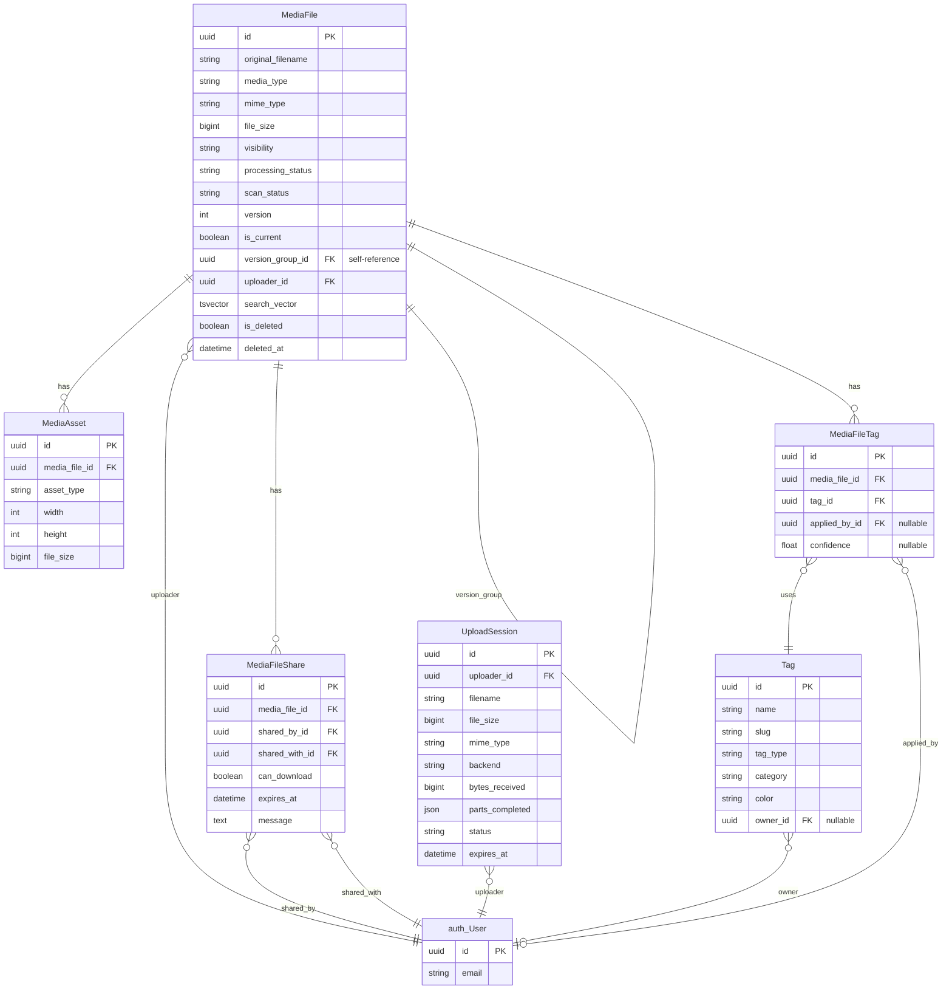
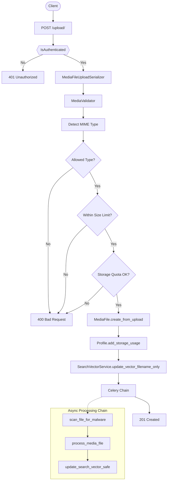
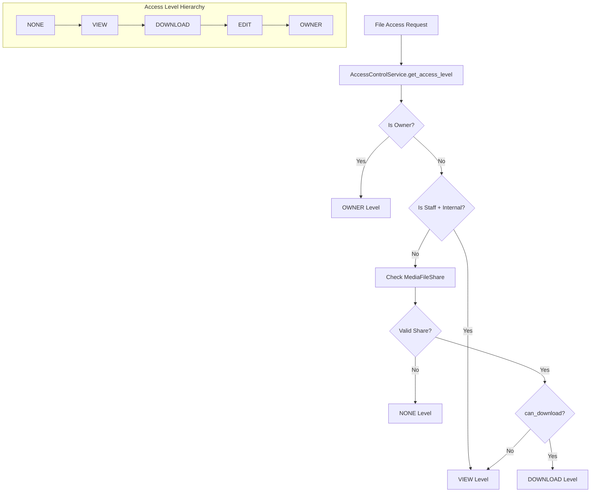
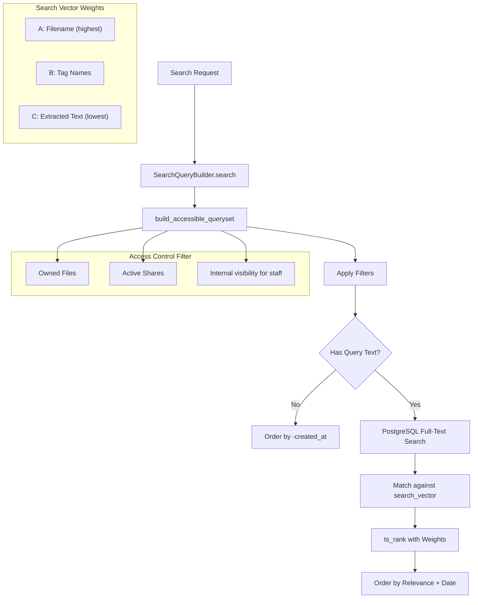
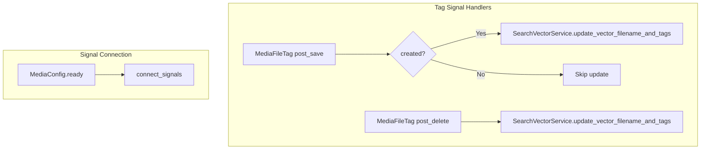
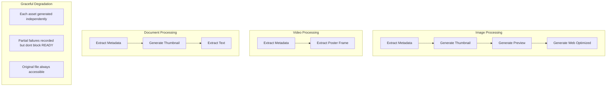

# Media Architecture

> Last generated: 2025-12-17 UTC

**Related Apps:** [core](../core/ARCHITECTURE.md) | [authentication](../authentication/ARCHITECTURE.md)

---

## Overview

The media app provides comprehensive file management including uploads, storage, sharing, tagging, and full-text search. It supports both standard and chunked (resumable) uploads with S3 or local storage backends, content-based MIME type validation, malware scanning, async processing pipelines, and PostgreSQL full-text search with weighted relevance ranking.

### Dependencies

| Direction | Apps | Notes |
|-----------|------|-------|
| **Imports from** | `core` | BaseModel, BaseService, ServiceResult, SoftDeleteMixin |
| **Imports from** | `authentication` | User model for ownership and sharing |
| **Imported by** | None currently | Standalone media management |

### External Packages
- `python-magic` - Content-based MIME type detection
- `pillow` - Image processing and thumbnail generation
- `boto3` - S3 storage integration (optional)
- `celery` - Async task processing
- `clamd` - ClamAV malware scanning (optional)

---

## Data Models



### Model Details

| Model | Description |
|-------|-------------|
| **MediaFile** | Primary model with soft delete, version tracking, processing/scan status, and full-text search vector |
| **MediaAsset** | Generated derivatives (thumbnails, previews, transcoded videos, extracted text) |
| **MediaFileShare** | Explicit share grants with expiration and download permissions |
| **UploadSession** | Tracks chunked upload progress for both local and S3 backends |
| **Tag** | Categorization with user/system/auto types and hybrid scoping |
| **MediaFileTag** | Through table with audit fields and confidence scores |

### Enum Values

| Model | Field | Values |
|-------|-------|--------|
| MediaFile | `media_type` | `image`, `video`, `document`, `audio`, `other` |
| MediaFile | `visibility` | `private`, `shared`, `internal` |
| MediaFile | `processing_status` | `pending`, `processing`, `ready`, `failed` |
| MediaFile | `scan_status` | `pending`, `clean`, `infected`, `error` |
| MediaAsset | `asset_type` | `thumbnail`, `preview`, `web_optimized`, `poster`, `transcoded`, `low_res`, `pdf_preview`, `extracted_text` |
| UploadSession | `backend` | `local`, `s3` |
| UploadSession | `status` | `in_progress`, `completed`, `expired`, `failed` |
| Tag | `tag_type` | `user`, `system`, `auto` |

---

## Component Flow

### Upload Flow (Standard)



### Chunked Upload Flow

```mermaid
flowchart TD
    subgraph Session["1. Create Session"]
        Init[POST /chunked/sessions/] --> CreateSession[ChunkedUploadService.create_session]
        CreateSession --> S3{S3 Backend?}
        S3 -->|Yes| InitMultipart[S3 CreateMultipartUpload]
        S3 -->|No| CreateTempDir[Create Local Temp Dir]
        InitMultipart --> SaveSession[Save UploadSession]
        CreateTempDir --> SaveSession
    end

    subgraph Upload["2. Upload Parts"]
        GetTarget[GET /parts/{n}/target/] --> Target{Backend?}
        Target -->|S3| PresignedURL[Return Presigned S3 URL]
        Target -->|Local| LocalURL[Return Server Endpoint]

        PresignedURL --> UploadS3[Client uploads to S3]
        UploadS3 --> RecordPart[POST /parts/{n}/complete/]

        LocalURL --> UploadLocal[PUT /parts/{n}/]
        UploadLocal --> SaveChunk[Save to Temp Dir]
        SaveChunk --> UpdateProgress[Update Session Progress]
        RecordPart --> UpdateProgress
    end

    subgraph Finalize["3. Finalize"]
        Complete[POST /finalize/] --> VerifyParts{All Parts?}
        VerifyParts -->|No| Error[400 Missing Parts]
        VerifyParts -->|Yes| Backend{Backend?}
        Backend -->|S3| CompleteMultipart[S3 CompleteMultipartUpload]
        Backend -->|Local| AssembleChunks[Assemble Chunks]
        CompleteMultipart --> CreateMediaFile[Create MediaFile]
        AssembleChunks --> CreateMediaFile
        CreateMediaFile --> Cleanup[Cleanup Temp Resources]
        Cleanup --> TriggerProcessing[Trigger Scan + Process Chain]
    end

    SaveSession --> GetTarget
    UpdateProgress --> Complete
```

### Access Control Flow



### Full-Text Search Flow



### Signal Flow



---

## External Interfaces

### API Endpoints

| Method | Path | View | Description |
|--------|------|------|-------------|
| GET | `/api/v1/media/search/` | `MediaFileSearchView` | Full-text search with filters |
| GET | `/api/v1/media/quota/` | `QuotaStatusView` | Storage quota status |
| POST | `/api/v1/media/upload/` | `MediaUploadView` | Standard file upload |
| GET | `/api/v1/media/files/{id}/` | `MediaFileDetailView` | File metadata |
| GET | `/api/v1/media/files/{id}/download/` | `MediaFileDownloadView` | Download file |
| GET | `/api/v1/media/files/{id}/view/` | `MediaFileViewView` | View file inline |
| GET | `/api/v1/media/files/{id}/shares/` | `MediaFileShareView` | List file shares |
| POST | `/api/v1/media/files/{id}/shares/` | `MediaFileShareView` | Create share |
| DELETE | `/api/v1/media/files/{id}/shares/{user_id}/` | `MediaFileShareDeleteView` | Revoke share |
| GET | `/api/v1/media/shared-with-me/` | `MediaFilesSharedWithMeView` | Files shared with user |

**Chunked Upload Endpoints:**

| Method | Path | View | Description |
|--------|------|------|-------------|
| POST | `/api/v1/media/chunked/sessions/` | `ChunkedUploadSessionView` | Create upload session |
| GET | `/api/v1/media/chunked/sessions/{id}/` | `ChunkedUploadSessionDetailView` | Session status |
| DELETE | `/api/v1/media/chunked/sessions/{id}/` | `ChunkedUploadSessionDetailView` | Abort upload |
| GET | `/api/v1/media/chunked/sessions/{id}/parts/{n}/target/` | `ChunkedUploadPartTargetView` | Get upload target |
| PUT | `/api/v1/media/chunked/sessions/{id}/parts/{n}/` | `ChunkedUploadPartView` | Upload chunk (local) |
| POST | `/api/v1/media/chunked/sessions/{id}/parts/{n}/complete/` | `ChunkedUploadPartCompleteView` | Record completion (S3) |
| POST | `/api/v1/media/chunked/sessions/{id}/finalize/` | `ChunkedUploadFinalizeView` | Complete upload |
| GET | `/api/v1/media/chunked/sessions/{id}/progress/` | `ChunkedUploadProgressView` | Get progress |

**Tag Endpoints:**

| Method | Path | View | Description |
|--------|------|------|-------------|
| GET | `/api/v1/media/tags/` | `TagListCreateView` | List accessible tags |
| POST | `/api/v1/media/tags/` | `TagListCreateView` | Create user tag |
| GET | `/api/v1/media/tags/{id}/` | `TagDetailView` | Tag details |
| DELETE | `/api/v1/media/tags/{id}/` | `TagDetailView` | Delete user tag |
| GET | `/api/v1/media/files/{id}/tags/` | `MediaFileTagsView` | List file tags |
| POST | `/api/v1/media/files/{id}/tags/` | `MediaFileTagsView` | Apply tag to file |
| DELETE | `/api/v1/media/files/{id}/tags/{tag_id}/` | `MediaFileTagDeleteView` | Remove tag from file |
| GET | `/api/v1/media/files/by-tags/` | `FilesByTagView` | Query files by tags |

**URL Namespace:** `media`

### Signals Sent

| Signal | Sender | Trigger | Handler Location |
|--------|--------|---------|------------------|
| `post_save` | `MediaFileTag` | Tag applied | `media.signals` |
| `post_delete` | `MediaFileTag` | Tag removed | `media.signals` |

### Celery Tasks

| Task | Purpose | Schedule | Queue |
|------|---------|----------|-------|
| `scan_file_for_malware` | ClamAV malware scan | On upload | `default` |
| `process_media_file` | Generate assets, extract metadata | After scan | `default` |
| `update_search_vector_safe` | Update FTS vector with content | After processing | `default` |
| `retry_failed_processing` | Retry failed files | Every 5 min | `maintenance` |
| `cleanup_stuck_processing` | Reset stuck jobs | Every 5 min | `maintenance` |
| `rescan_skipped_files` | Rescan after scanner outage | Every 15 min | `maintenance` |
| `check_antivirus_health` | ClamAV health check | Every 5 min | `maintenance` |
| `cleanup_expired_upload_sessions` | Clean expired sessions | Hourly | `maintenance` |
| `cleanup_orphaned_local_temp_dirs` | Clean orphaned temp dirs | Daily | `maintenance` |
| `cleanup_orphaned_s3_multipart_uploads` | Abort orphaned S3 uploads | Daily | `maintenance` |
| `recalculate_user_storage_quota` | Fix quota drift for user | On demand | `default` |
| `recalculate_all_storage_quotas` | Fix quota drift for all users | Weekly | `maintenance` |
| `hard_delete_expired_files` | Permanent deletion | Daily 2 AM | `maintenance` |
| `reconcile_search_vectors` | Recompute document vectors | Weekly Sun 3 AM | `maintenance` |

---

## Service Layer

### AccessControlService

Centralized access control with hierarchical permission levels:

```python
# Check access level
level = AccessControlService.get_access_level(user, media_file)
if level >= FileAccessLevel.DOWNLOAD:
    serve_file(media_file)

# Boolean convenience methods
AccessControlService.user_can_access(user, file)    # >= VIEW
AccessControlService.user_can_download(user, file)  # >= DOWNLOAD
AccessControlService.user_can_edit(user, file)      # >= EDIT

# Share management
AccessControlService.share_file(file, owner, recipient, can_download=True, expires_in_days=7)
AccessControlService.revoke_share(file, owner, recipient)
AccessControlService.get_file_shares(file)
AccessControlService.get_files_shared_with_user(user)
```

### ChunkedUploadService

Resumable uploads with local/S3 backend abstraction:

```python
service = get_chunked_upload_service()  # Factory returns appropriate backend

# Create session
result = service.create_session(user, filename, file_size, mime_type, media_type)

# Get upload target for chunk
target = service.get_chunk_target(session, part_number)

# For local backend: receive chunk
service.receive_chunk(session, part_number, chunk_data)

# For S3 backend: record completion after direct upload
service.record_completed_part(session, part_number, etag, size)

# Finalize and create MediaFile
result = service.finalize_upload(session)
```

### SearchVectorService

PostgreSQL full-text search vector management:

```python
# Initial vector (filename only - fast, immediate)
SearchVectorService.update_vector_filename_only(media_file)

# After tag changes (filename + tags)
SearchVectorService.update_vector_filename_and_tags(media_file)

# After processing (filename + tags + extracted text)
SearchVectorService.update_vector(media_file, include_content=True)
```

### SearchQueryBuilder

Query builder with access control baked in:

```python
# Get accessible files for user
qs = SearchQueryBuilder.build_accessible_queryset(user)

# Search with optional query and filters
qs = SearchQueryBuilder.search(
    user,
    query="budget report",
    filters={
        "media_type": "document",
        "uploaded_after": date(2024, 1, 1),
        "tags": ["finance", "q4"],
    },
)
```

### MalwareScanner

ClamAV integration with circuit breaker pattern:

```python
scanner = MalwareScanner()

# Check availability
if scanner.is_available():
    result = scanner.scan_media_file(media_file)
    # result.status: CLEAN, INFECTED, SKIPPED, ERROR

# Health check
status = scanner.get_circuit_status()
definitions = scanner.check_definitions()
```

### FileDeliveryService

Secure file delivery with X-Accel-Redirect support:

```python
# Get protected download URL
url = FileDeliveryService.get_download_url(media_file)

# Serve file response
response = FileDeliveryService.serve_file_response(media_file, as_attachment=True)
```

---

## Processing Pipeline



### Asset Types by Media Type

| Media Type | Generated Assets |
|------------|------------------|
| **Image** | thumbnail, preview, web_optimized |
| **Video** | poster |
| **Document** | thumbnail, extracted_text |
| **Audio** | None (marked ready immediately) |

---

## Admin Configuration

| Model | Admin Class | Customizations |
|-------|-------------|----------------|
| `MediaFile` | Default | List filters by type, status, visibility |
| `MediaAsset` | Default | Inline with MediaFile |
| `MediaFileShare` | Default | Filter by expiration |
| `UploadSession` | Default | Filter by status, backend |
| `Tag` | Default | Filter by type, owner |
| `MediaFileTag` | Default | Filter by confidence |

---

## Database Indexes

### Optimized Queries

| Index | Purpose |
|-------|---------|
| `idx_processing_queue` | Partial index for pending processing jobs |
| `idx_scan_queue` | Partial index for pending scans |
| `idx_active_files` | Partial index for non-deleted files by user |
| `idx_media_search_vector` | GIN index for full-text search |
| `(uploader, media_type)` | User's files by type |
| `(uploader, created_at)` | User's files by date |
| `(visibility, is_current)` | Public/shared files |
| `(version_group, version)` | Version history queries |

### Constraints

| Constraint | Purpose |
|------------|---------|
| `media_file_size_positive` | File size must be > 0 |
| `media_file_version_at_least_one` | Version starts at 1 |
| `media_file_unique_current_per_group` | One current version per group |
| `media_file_unique_version_in_group` | Unique version numbers |
| `unique_asset_type_per_media_file` | One asset per type per file |
| `media_share_unique_file_user` | One share per file/user |
| `tag_unique_user_slug` | User tags unique per owner |
| `tag_unique_global_slug` | System/auto tags globally unique |
| `tag_owner_type_consistency` | User tags must have owner |
