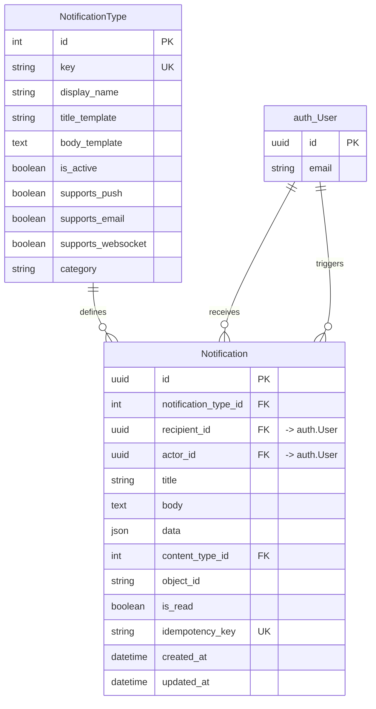
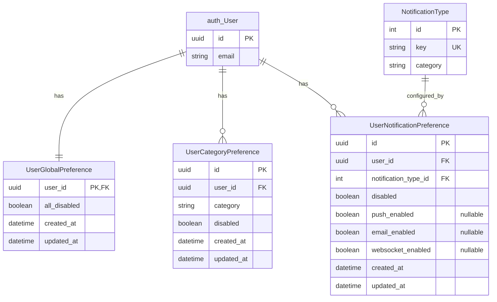
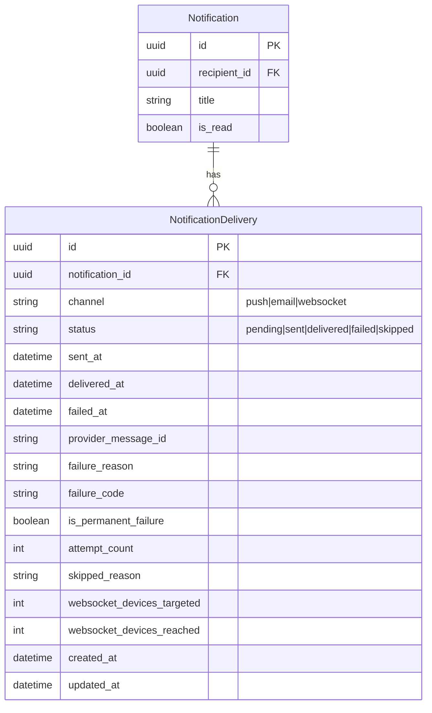
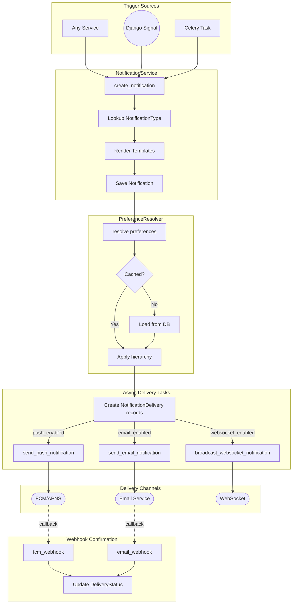
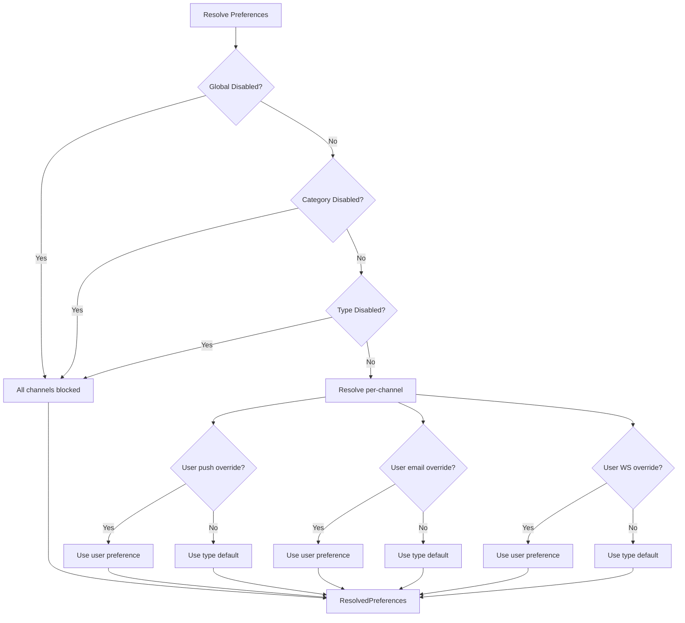
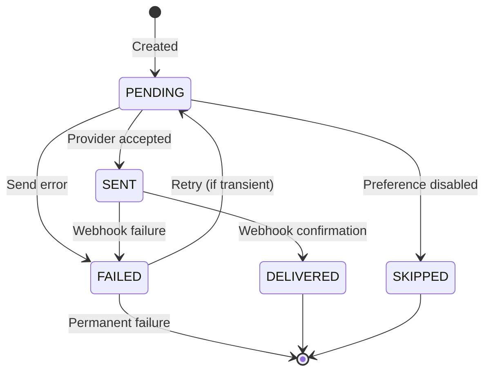

# Notifications Architecture

> Last generated: 2025-12-22 UTC

**Related Apps:** [core](../core/ARCHITECTURE.md) | [authentication](../authentication/ARCHITECTURE.md) | [chat](../chat/ARCHITECTURE.md)

---

## Overview

The notifications app provides a comprehensive multi-channel notification system supporting push notifications (FCM/APNS), email, and WebSocket delivery. It features a hierarchical preference system allowing users to control notifications at global, category, and type levels, with per-channel granularity. Delivery tracking enables retry logic, analytics, and webhook-based delivery confirmation.

### Dependencies

| Direction | Apps | Notes |
|-----------|------|-------|
| **Imports from** | `core` | BaseModel, BaseService, ServiceResult |
| **Imports from** | `authentication` | User model for recipient/actor |
| **Imported by** | None | Standalone notification delivery |

### External Packages
- `celery` - Async task processing for delivery
- `django-contenttypes` - Generic foreign key for source objects
- `redis` - Preference caching

---

## Data Models

### Core Models



### Preference Models



### Delivery Tracking



### Model Details

| Model | Description |
|-------|-------------|
| **NotificationType** | Configuration table defining notification templates, channel support, and category |
| **Notification** | Individual notification instances with rendered content and read status |
| **UserGlobalPreference** | Master switch to disable all notifications for a user (OneToOne) |
| **UserCategoryPreference** | Category-level disable (e.g., disable all marketing notifications) |
| **UserNotificationPreference** | Per-type preferences with optional per-channel overrides |
| **NotificationDelivery** | Tracks delivery status per channel with retry support and provider confirmation |

### Enums

| Enum | Values | Purpose |
|------|--------|---------|
| **NotificationCategory** | `transactional`, `social`, `marketing`, `system` | Groups notification types for category preferences |
| **DeliveryChannel** | `push`, `email`, `websocket` | Delivery channel identifiers |
| **DeliveryStatus** | `pending`, `sent`, `delivered`, `failed`, `skipped` | Delivery state machine |
| **SkipReason** | `global_disabled`, `category_disabled`, `type_disabled`, `channel_disabled`, `no_device_token`, `no_email`, `no_connections` | Why delivery was skipped |

---

## Component Flow

### Notification Creation and Delivery Flow



### Preference Resolution Hierarchy



### Read Status Flow

```mermaid
flowchart TD
    List[GET /notifications/] --> Filter{Filter params?}
    Filter -->|is_read| FilteredList[Filtered QuerySet]
    Filter -->|None| FullList[Full QuerySet]

    Unread[GET /unread-count/] --> Count[Count Unread]
    Count --> Badge[Return Badge Count]

    Read[POST /{id}/read/] --> Validate{Own notification?}
    Validate -->|Yes| MarkRead[Set is_read=True]
    Validate -->|No| Forbidden[403 Forbidden]

    ReadAll[POST /read-all/] --> BulkUpdate[Bulk Update is_read]
    BulkUpdate --> ReturnCount[Return marked_count]
```

### Delivery Status State Machine



---

## External Interfaces

### API Endpoints

#### Notifications

| Method | Path | View | Description |
|--------|------|------|-------------|
| GET | `/api/v1/notifications/` | `NotificationViewSet.list` | List user's notifications |
| GET | `/api/v1/notifications/{id}/` | `NotificationViewSet.retrieve` | Get notification detail |
| GET | `/api/v1/notifications/unread-count/` | `NotificationViewSet.unread_count` | Get unread count |
| POST | `/api/v1/notifications/{id}/read/` | `NotificationViewSet.read` | Mark single as read |
| POST | `/api/v1/notifications/read-all/` | `NotificationViewSet.read_all` | Mark all as read |

#### Preferences

| Method | Path | View | Description |
|--------|------|------|-------------|
| GET | `/api/v1/notifications/preferences/` | `PreferenceViewSet.list` | Get all user preferences |
| PATCH | `/api/v1/notifications/preferences/global/` | `PreferenceViewSet.global_preference` | Update global mute setting |
| PATCH | `/api/v1/notifications/preferences/category/` | `PreferenceViewSet.category_preference` | Update category preference |
| PATCH | `/api/v1/notifications/preferences/type/` | `PreferenceViewSet.type_preference` | Update type preference |
| POST | `/api/v1/notifications/preferences/bulk/` | `PreferenceViewSet.bulk_update` | Bulk update preferences |
| POST | `/api/v1/notifications/preferences/reset/` | `PreferenceViewSet.reset` | Reset all preferences |

#### Notification Types

| Method | Path | View | Description |
|--------|------|------|-------------|
| GET | `/api/v1/notifications/types/` | `NotificationTypeViewSet.list` | List active notification types |
| GET | `/api/v1/notifications/types/{key}/` | `NotificationTypeViewSet.retrieve` | Get type by key |

#### Webhooks

| Method | Path | View | Description |
|--------|------|------|-------------|
| POST | `/api/v1/notifications/webhooks/fcm/` | `fcm_webhook` | FCM delivery callback |
| POST | `/api/v1/notifications/webhooks/email/` | `email_webhook` | Email delivery callback |

**URL Namespace:** `notifications`

### Query Parameters

| Parameter | Type | Description |
|-----------|------|-------------|
| `is_read` | boolean | Filter by read status (`true`/`false`) |
| `type` | string | Filter by notification type key |

### Celery Tasks

| Task | Purpose | Retry | Queue |
|------|---------|-------|-------|
| `send_push_notification` | Deliver via FCM/APNS | 3x with exponential backoff | `default` |
| `send_email_notification` | Deliver via email | 3x with exponential backoff | `default` |
| `broadcast_websocket_notification` | Broadcast via Channels | 3x with exponential backoff | `default` |

### Webhook Payloads

#### FCM Webhook

```json
{
    "message_id": "provider-message-id",
    "status": "delivered",
    "error_code": "optional-error-code",
    "error_message": "optional-error-message"
}
```

**Headers:** `X-FCM-Signature` (HMAC-SHA256)

#### Email Webhook

```json
{
    "message_id": "provider-message-id",
    "status": "delivered",
    "error_code": "optional-error-code",
    "error_message": "optional-error-message"
}
```

**Headers:** `X-Email-Signature` (HMAC-SHA256)

---

## Service Layer

### NotificationService

```python
# Create notification with template rendering
NotificationService.create_notification(
    recipient: User,
    type_key: str,
    data: dict | None = None,  # Template placeholders
    title: str | None = None,  # Override template
    body: str | None = None,   # Override template
    actor: User | None = None,
    source_object: Model | None = None,
    idempotency_key: str | None = None,
) -> ServiceResult[Notification]

# Mark notifications as read
NotificationService.mark_as_read(notification, user) -> ServiceResult[Notification]
NotificationService.mark_all_as_read(user) -> ServiceResult[int]
```

### PreferenceService

```python
# Get all preferences for a user
PreferenceService.get_user_preferences(user: User) -> ServiceResult[dict]

# Set global preference
PreferenceService.set_global_preference(
    user: User,
    all_disabled: bool,
) -> ServiceResult[UserGlobalPreference]

# Set category preference
PreferenceService.set_category_preference(
    user: User,
    category: str,
    disabled: bool,
) -> ServiceResult[UserCategoryPreference]

# Set type preference
PreferenceService.set_type_preference(
    user: User,
    type_key: str,
    disabled: bool | None = None,
    push_enabled: bool | None = None,
    email_enabled: bool | None = None,
    websocket_enabled: bool | None = None,
) -> ServiceResult[UserNotificationPreference]

# Reset all preferences to defaults
PreferenceService.reset_preferences(user: User) -> ServiceResult[dict]
```

### PreferenceResolver

```python
# Resolve preferences for a user/type combination
PreferenceResolver.resolve(
    user: User,
    notification_type: NotificationType,
    use_cache: bool = True,
) -> ResolvedPreferences

# Bulk resolve for multiple users
PreferenceResolver.resolve_bulk(
    users: list[User],
    notification_type: NotificationType,
) -> dict[int, ResolvedPreferences]

# Invalidate cached preferences
PreferenceResolver.invalidate_cache(user_id: int, notification_type_id: int)
```

### ResolvedPreferences

```python
@dataclass(frozen=True)
class ResolvedPreferences:
    push_enabled: bool
    email_enabled: bool
    websocket_enabled: bool
    blocked: bool = False
    blocked_reason: str | None = None

    @property
    def any_enabled(self) -> bool: ...

    def is_channel_enabled(self, channel: str) -> bool: ...
```

---

## Usage Examples

### Creating Notifications

```python
from notifications.services import NotificationService

# With template rendering
result = NotificationService.create_notification(
    recipient=user,
    type_key="new_follower",
    data={"actor_name": follower.display_name},
    actor=follower,
    source_object=follower,  # Generic FK
)

# With explicit content
result = NotificationService.create_notification(
    recipient=user,
    type_key="system_alert",
    title="Maintenance Notice",
    body="System will be down for maintenance.",
)

# With idempotency key (prevents duplicates)
result = NotificationService.create_notification(
    recipient=user,
    type_key="order_shipped",
    data={"order_id": "12345"},
    idempotency_key=f"order_shipped_{order.id}",
)
```

### Managing Preferences

```python
from notifications.services import PreferenceService

# Disable all notifications
PreferenceService.set_global_preference(user, all_disabled=True)

# Disable marketing category
PreferenceService.set_category_preference(
    user, category="marketing", disabled=True
)

# Disable email for specific type
PreferenceService.set_type_preference(
    user, type_key="new_follower", email_enabled=False
)

# Get all user preferences
result = PreferenceService.get_user_preferences(user)
# Returns: {
#     "global": {"all_disabled": False},
#     "categories": {"marketing": {"disabled": True}},
#     "types": {"new_follower": {"email_enabled": False}}
# }
```

### Resolving Preferences Before Delivery

```python
from notifications.preferences import PreferenceResolver

# Check if notification should be delivered
prefs = PreferenceResolver.resolve(user, notification_type)

if prefs.blocked:
    # Skip delivery, record reason
    delivery.status = DeliveryStatus.SKIPPED
    delivery.skipped_reason = prefs.blocked_reason
elif prefs.is_channel_enabled("push"):
    send_push_notification.delay(delivery.id)
```

---

## Admin Configuration

| Model | Admin Class | Customizations |
|-------|-------------|----------------|
| `NotificationType` | `NotificationTypeAdmin` | List filters, search, fieldsets for templates and channels |
| `Notification` | `NotificationAdmin` | Read-only, search by recipient email |
| `UserGlobalPreference` | `UserGlobalPreferenceAdmin` | Filter by disabled status |
| `UserCategoryPreference` | `UserCategoryPreferenceAdmin` | Filter by category and status |
| `UserNotificationPreference` | `UserNotificationPreferenceAdmin` | Filter by type and channel overrides |
| `NotificationDelivery` | `NotificationDeliveryAdmin` | Read-only, filter by channel/status, no add/delete |

---

## Notification Types

### Template System

Templates use Python `str.format()` syntax:

```python
NotificationType(
    key="new_follower",
    display_name="New Follower",
    title_template="{actor_name} started following you",
    body_template="",
    category="social",
    supports_push=True,
    supports_email=False,
    supports_websocket=True,
)
```

### Recommended Types by Category

| Category | Key | Display Name | Push | Email | WebSocket |
|----------|-----|--------------|------|-------|-----------|
| **Social** | `new_follower` | New Follower | Yes | No | Yes |
| **Social** | `new_message` | New Message | Yes | No | Yes |
| **Social** | `mention` | Mentioned | Yes | No | Yes |
| **Transactional** | `payment_received` | Payment Received | Yes | Yes | Yes |
| **Transactional** | `order_shipped` | Order Shipped | Yes | Yes | Yes |
| **Transactional** | `subscription_renewed` | Subscription Renewed | Yes | Yes | No |
| **Marketing** | `promotion` | New Promotion | Yes | Yes | No |
| **Marketing** | `newsletter` | Newsletter | No | Yes | No |
| **System** | `system_alert` | System Alert | Yes | Yes | Yes |
| **System** | `security_alert` | Security Alert | Yes | Yes | Yes |

---

## Data Flow

### Serializer Responses

#### Notification Response

```json
{
    "id": "uuid",
    "type_key": "new_follower",
    "title": "John Doe started following you",
    "body": "",
    "data": {"actor_name": "John Doe"},
    "actor_name": "john@example.com",
    "is_read": false,
    "created_at": "2025-01-01T00:00:00Z"
}
```

#### User Preferences Response

```json
{
    "global": {
        "all_disabled": false
    },
    "categories": {
        "marketing": {
            "disabled": true
        }
    },
    "types": {
        "new_follower": {
            "disabled": false,
            "push_enabled": true,
            "email_enabled": false,
            "websocket_enabled": null
        }
    }
}
```

#### Notification Type Response

```json
{
    "key": "new_follower",
    "display_name": "New Follower",
    "category": "social",
    "supports_push": true,
    "supports_email": false,
    "supports_websocket": true
}
```

---

## Integration Points

### Creating Notifications from Other Apps

```python
# In authentication/signals.py
from notifications.services import NotificationService

@receiver(user_signed_up)
def notify_admin_of_signup(sender, user, **kwargs):
    for admin in User.objects.filter(is_staff=True):
        NotificationService.create_notification(
            recipient=admin,
            type_key="new_user_signup",
            data={"user_email": user.email},
            actor=user,
        )
```

### WebSocket Broadcasting

The `broadcast_websocket_notification` task broadcasts to user-specific channel groups:

```python
from channels.layers import get_channel_layer
from asgiref.sync import async_to_sync

channel_layer = get_channel_layer()
async_to_sync(channel_layer.group_send)(
    f"notifications_{user.id}",
    {
        "type": "notification.message",
        "notification": serialized_data,
    }
)
```

### Webhook Configuration

Configure webhook secrets in settings:

```python
# FCM webhook verification
FCM_WEBHOOK_SECRET = env("FCM_WEBHOOK_SECRET", default="")

# Email webhook verification
EMAIL_WEBHOOK_SECRET = env("EMAIL_WEBHOOK_SECRET", default="")
```

---

## Caching Strategy

Preferences are cached in Redis with the following characteristics:

| Cache Key Pattern | TTL | Invalidation |
|-------------------|-----|--------------|
| `notif_pref:{user_id}:{type_id}` | 5 minutes | On preference update |

Cache invalidation occurs automatically when:
- User updates any preference level
- PreferenceService methods modify preferences
- Reset is called
