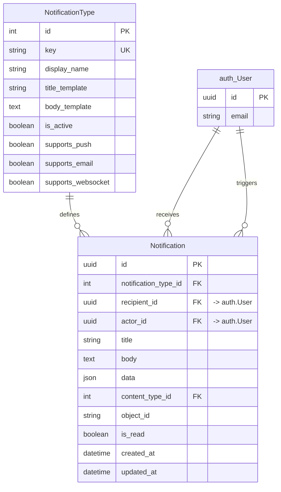
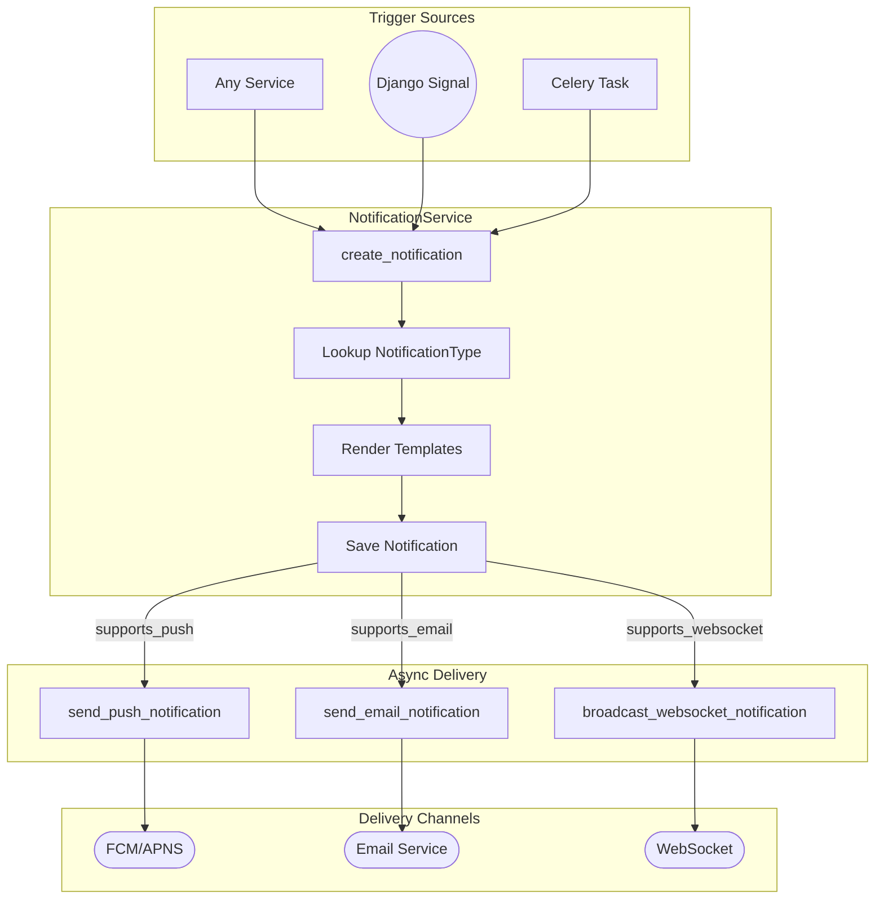

# Notifications Architecture

> Last generated: 2025-12-15 UTC

**Related Apps:** [core](../core/ARCHITECTURE.md) | [authentication](../authentication/ARCHITECTURE.md) | [chat](../chat/ARCHITECTURE.md)

---

## Overview

The notifications app provides a multi-channel notification system supporting push notifications, email, and WebSocket delivery. It uses a template-based approach with configurable notification types and tracks read status per user.

### Dependencies

| Direction | Apps | Notes |
|-----------|------|-------|
| **Imports from** | `core` | BaseModel, BaseService, ServiceResult |
| **Imports from** | `authentication` | User model for recipient/actor |
| **Imported by** | None | Standalone notification delivery |

### External Packages
- `celery` - Async task processing for delivery
- `django-contenttypes` - Generic foreign key for source objects

---

## Data Models



### Model Details

| Model | Description |
|-------|-------------|
| **NotificationType** | Configuration table defining notification templates and channel support |
| **Notification** | Individual notification instances with rendered content and read status |

---

## Component Flow

### Notification Creation Flow



### Read Status Flow

```mermaid
flowchart TD
    List[GET /notifications/] --> Filter{Filter params?}
    Filter -->|is_read| FilteredList[Filtered QuerySet]
    Filter -->|None| FullList[Full QuerySet]

    Unread[GET /unread-count/] --> Count[Count Unread]
    Count --> Badge[Return Badge Count]

    Read[POST /{id}/read/] --> Validate{Own notification?}
    Validate -->|Yes| MarkRead[Set is_read=True]
    Validate -->|No| Forbidden[403 Forbidden]

    ReadAll[POST /read-all/] --> BulkUpdate[Bulk Update is_read]
    BulkUpdate --> ReturnCount[Return marked_count]
```

---

## External Interfaces

### API Endpoints

| Method | Path | View | Description |
|--------|------|------|-------------|
| GET | `/api/v1/notifications/` | `NotificationViewSet.list` | List user's notifications |
| GET | `/api/v1/notifications/{id}/` | `NotificationViewSet.retrieve` | Get notification detail |
| GET | `/api/v1/notifications/unread-count/` | `NotificationViewSet.unread_count` | Get unread count |
| POST | `/api/v1/notifications/{id}/read/` | `NotificationViewSet.read` | Mark single as read |
| POST | `/api/v1/notifications/read-all/` | `NotificationViewSet.read_all` | Mark all as read |

**URL Namespace:** `notifications`

### Query Parameters

| Parameter | Type | Description |
|-----------|------|-------------|
| `is_read` | boolean | Filter by read status (`true`/`false`) |
| `type` | string | Filter by notification type key |

### Celery Tasks

| Task | Purpose | Retry | Queue |
|------|---------|-------|-------|
| `send_push_notification` | Deliver via FCM/APNS | 3x with backoff | `default` |
| `send_email_notification` | Deliver via email | 3x with backoff | `default` |
| `broadcast_websocket_notification` | Broadcast via Channels | 3x with backoff | `default` |

---

## Service Layer

### NotificationService

```python
# Create notification with template rendering
NotificationService.create_notification(
    recipient: User,
    type_key: str,
    data: dict | None = None,  # Template placeholders
    title: str | None = None,  # Override template
    body: str | None = None,   # Override template
    actor: User | None = None,
    source_object: Model | None = None,
) -> ServiceResult[Notification]

# Mark notifications as read
NotificationService.mark_as_read(notification, user) -> ServiceResult[Notification]
NotificationService.mark_all_as_read(user) -> ServiceResult[int]
```

### Usage Example

```python
from notifications.services import NotificationService

# With template rendering
result = NotificationService.create_notification(
    recipient=user,
    type_key="new_follower",
    data={"actor_name": follower.display_name},
    actor=follower,
    source_object=follower,  # Generic FK
)

# With explicit content
result = NotificationService.create_notification(
    recipient=user,
    type_key="system_alert",
    title="Maintenance Notice",
    body="System will be down for maintenance.",
)
```

---

## Notification Types

### Template System

Templates use Python `str.format()` syntax:

```python
NotificationType(
    key="new_follower",
    display_name="New Follower",
    title_template="{actor_name} started following you",
    body_template="",
    supports_push=True,
    supports_email=False,
    supports_websocket=True,
)
```

### Recommended Types

| Key | Display Name | Push | Email | WebSocket |
|-----|--------------|------|-------|-----------|
| `new_follower` | New Follower | Yes | No | Yes |
| `new_message` | New Message | Yes | No | Yes |
| `payment_received` | Payment Received | Yes | Yes | Yes |
| `subscription_renewed` | Subscription Renewed | Yes | Yes | No |
| `system_alert` | System Alert | Yes | Yes | Yes |

---

## Data Flow

### Serializer Output

```json
{
    "id": "uuid",
    "type_key": "new_follower",
    "title": "John Doe started following you",
    "body": "",
    "data": {"actor_name": "John Doe"},
    "actor_name": "john@example.com",
    "is_read": false,
    "created_at": "2025-01-01T00:00:00Z"
}
```

### Unread Count Response

```json
{
    "unread_count": 5
}
```

### Mark All Read Response

```json
{
    "marked_count": 5
}
```

---

## Integration Points

### Creating Notifications from Other Apps

```python
# In authentication/signals.py
from notifications.services import NotificationService

@receiver(user_signed_up)
def notify_admin_of_signup(sender, user, **kwargs):
    for admin in User.objects.filter(is_staff=True):
        NotificationService.create_notification(
            recipient=admin,
            type_key="new_user_signup",
            data={"user_email": user.email},
            actor=user,
        )
```

### WebSocket Broadcasting (Stub)

The `broadcast_websocket_notification` task is a stub. To implement:

1. Serialize the notification
2. Get the user's channel group name
3. Broadcast via Django Channels channel layer

```python
from channels.layers import get_channel_layer
from asgiref.sync import async_to_sync

channel_layer = get_channel_layer()
async_to_sync(channel_layer.group_send)(
    f"notifications_{user.id}",
    {
        "type": "notification.message",
        "notification": serialized_data,
    }
)
```
