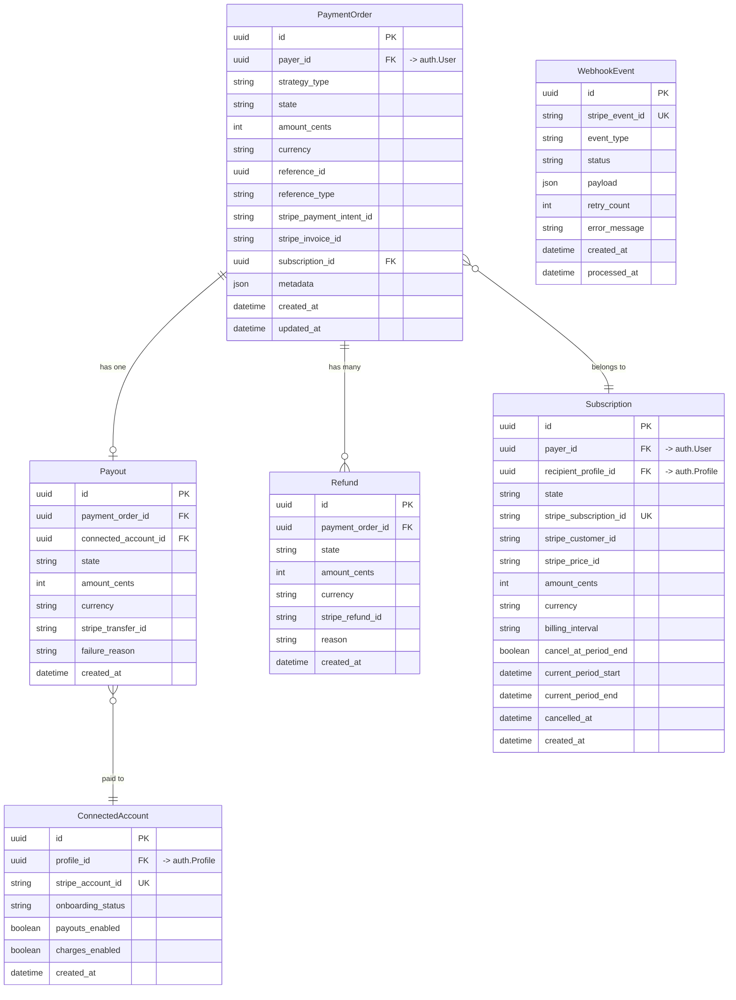
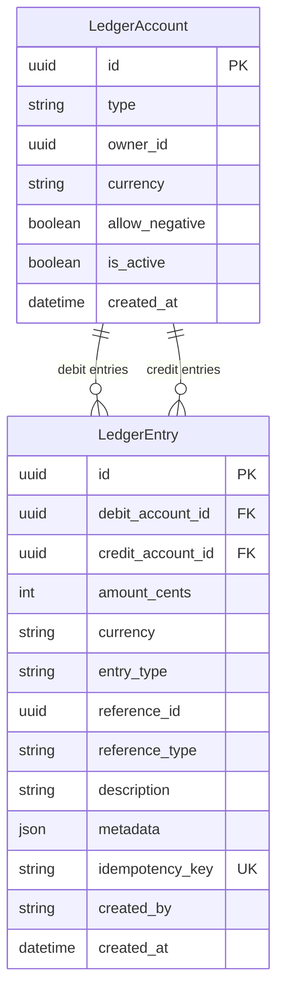
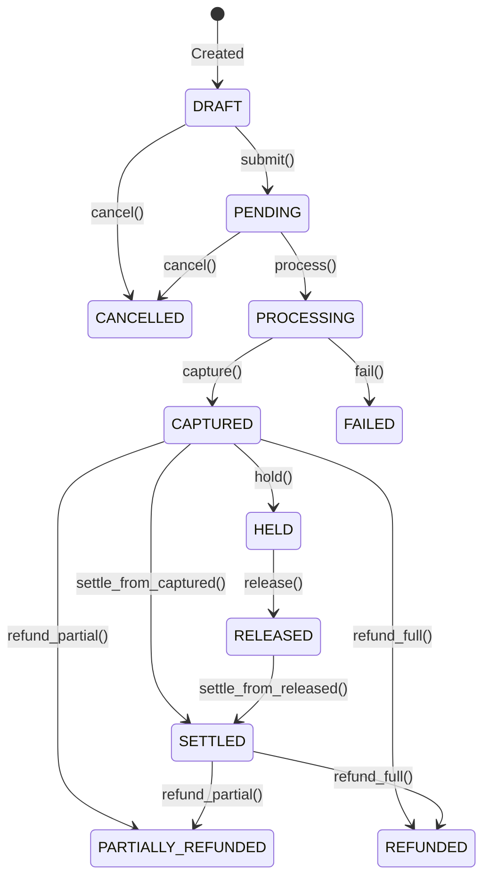
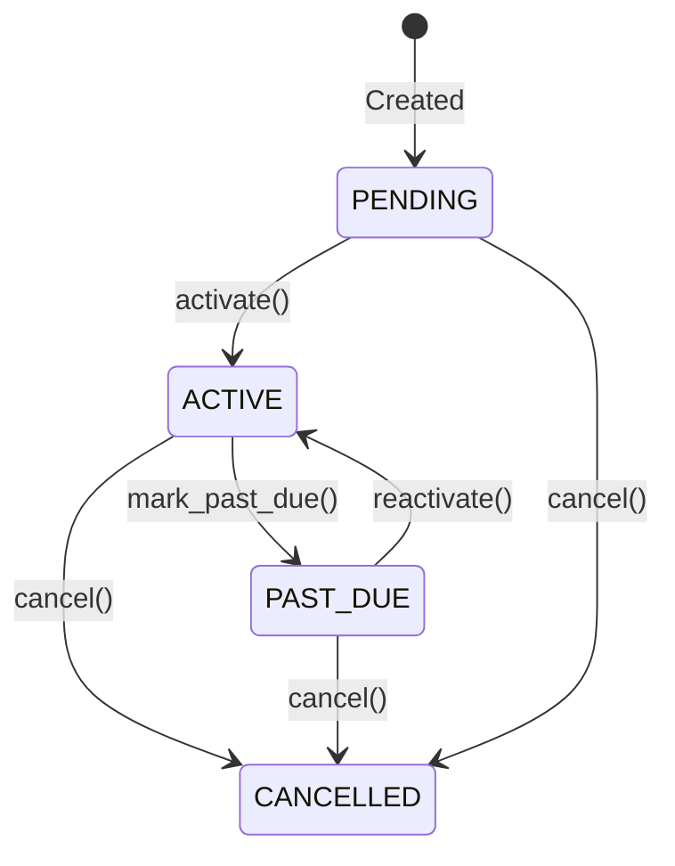
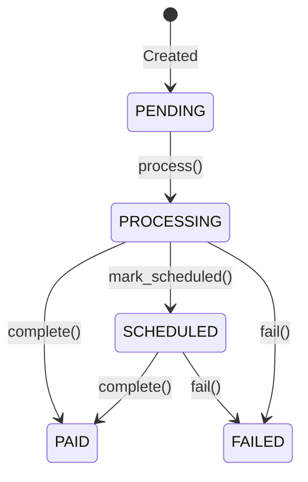
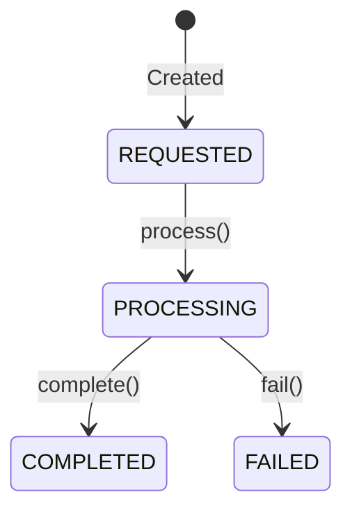
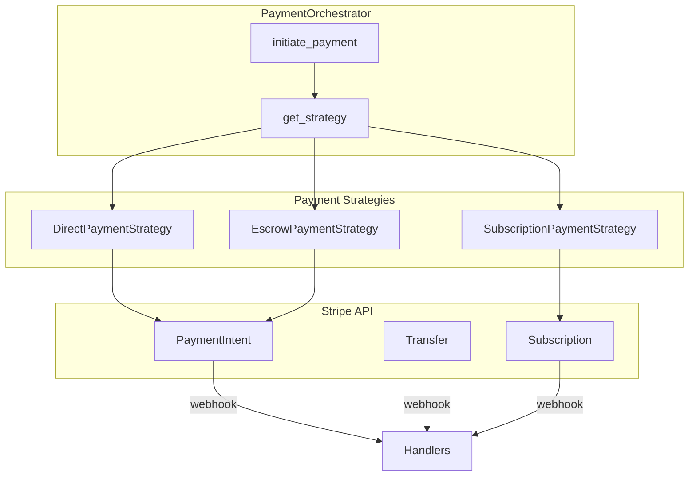
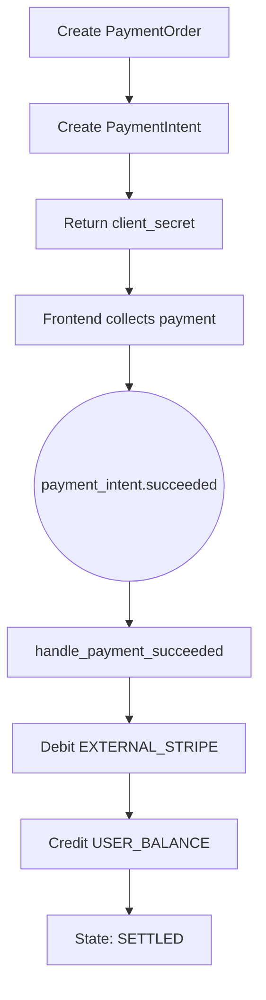
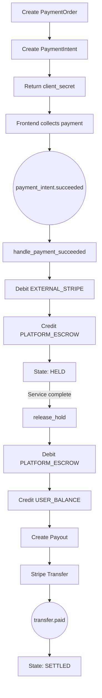
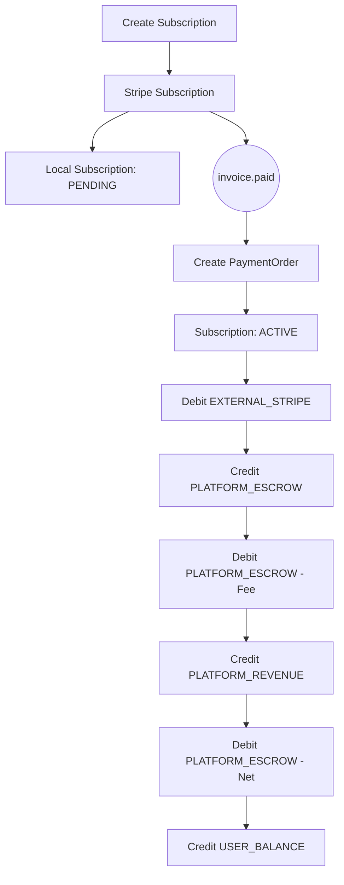

# Payments Architecture

> Last generated: 2025-12-15 UTC

**Related Apps:** [core](../core/ARCHITECTURE.md) | [authentication](../authentication/ARCHITECTURE.md)

---

## Overview

The payments app provides comprehensive payment processing via Stripe, including direct payments, escrow workflows, and recurring subscriptions. It implements a double-entry bookkeeping ledger for financial tracking and uses state machines for lifecycle management.

### Dependencies

| Direction | Apps | Notes |
|-----------|------|-------|
| **Imports from** | `core` | BaseModel, BaseService, ServiceResult |
| **Imports from** | `authentication` | User model for payer/recipient relationships |
| **Imported by** | None | Standalone payment processing |

### External Packages
- `stripe` - Payment processing API
- `django-fsm` concepts - State machine transitions (custom implementation)

---

## Data Models

### Payment Models



### Ledger Models



---

## State Machines

### PaymentOrder States



### Subscription States



### Payout States



### Refund States



---

## Component Flow

### Payment Strategy Pattern



### Direct Payment Flow



### Escrow Payment Flow



### Subscription Payment Flow



---

## External Interfaces

### API Endpoints

| Method | Path | View | Description |
|--------|------|------|-------------|
| POST | `/api/v1/payments/webhooks/stripe/` | `stripe_webhook` | Stripe webhook receiver |

**URL Namespace:** `payments`

### Webhook Events Handled

| Event Type | Handler | Action |
|------------|---------|--------|
| `payment_intent.succeeded` | `handle_payment_intent_succeeded` | Process successful payment |
| `payment_intent.payment_failed` | `handle_payment_intent_failed` | Handle payment failure |
| `payment_intent.canceled` | `handle_payment_intent_canceled` | Handle cancellation |
| `transfer.created` | `handle_transfer_created` | Mark payout scheduled |
| `transfer.paid` | `handle_transfer_paid` | Complete payout, settle order |
| `transfer.failed` | `handle_transfer_failed` | Mark payout failed |
| `charge.refunded` | `handle_charge_refunded` | Process refund |
| `account.updated` | `handle_account_updated` | Update connected account status |
| `invoice.paid` | `handle_invoice_paid` | Process subscription payment |
| `invoice.payment_failed` | `handle_invoice_payment_failed` | Mark subscription past_due |
| `customer.subscription.created` | `handle_subscription_created` | Acknowledge subscription |
| `customer.subscription.updated` | `handle_subscription_updated` | Sync subscription state |
| `customer.subscription.deleted` | `handle_subscription_deleted` | Cancel subscription |

---

## Ledger System

### Account Types

| Type | Purpose | Can Be Negative |
|------|---------|-----------------|
| `USER_BALANCE` | User's available balance (per owner) | No |
| `PLATFORM_ESCROW` | Money held during transactions | No |
| `PLATFORM_REVENUE` | Platform's earned fees | No |
| `EXTERNAL_STRIPE` | External money flow representation | Yes |

### Entry Types

| Type | Description |
|------|-------------|
| `PAYMENT_RECEIVED` | Money received from Stripe |
| `PAYMENT_RELEASED` | Money released from escrow |
| `FEE_COLLECTED` | Platform fee deducted |
| `PAYOUT` | Money sent to connected account |
| `REFUND` | Money returned to payer |
| `ADJUSTMENT` | Manual correction |
| `TRANSFER` | Direct account-to-account transfer |

### Double-Entry Flow Examples

**Direct Payment:**
```
1. EXTERNAL_STRIPE (debit) -> PLATFORM_ESCROW (credit) [PAYMENT_RECEIVED]
2. PLATFORM_ESCROW (debit) -> PLATFORM_REVENUE (credit) [FEE_COLLECTED]
3. PLATFORM_ESCROW (debit) -> USER_BALANCE (credit) [PAYMENT_RELEASED]
```

**Payout:**
```
4. USER_BALANCE (debit) -> EXTERNAL_STRIPE (credit) [PAYOUT]
```

---

## Service Layer

### PaymentOrchestrator

Central coordinator for payment operations:

```python
PaymentOrchestrator.initiate_payment(params) -> ServiceResult[PaymentResult]
PaymentOrchestrator.get_payment_order(payment_order_id) -> PaymentOrder | None
PaymentOrchestrator.get_payment_by_intent(intent_id) -> PaymentOrder | None
PaymentOrchestrator.get_strategy_for_order(order) -> PaymentStrategy
```

### LedgerService

Double-entry bookkeeping operations:

```python
LedgerService.get_or_create_account(type, owner_id, currency) -> LedgerAccount
LedgerService.record_entry(params) -> LedgerEntry
LedgerService.record_entries(entries) -> list[LedgerEntry]
LedgerService.get_balance(account) -> int
```

---

## Configuration

| Setting | Default | Description |
|---------|---------|-------------|
| `STRIPE_SECRET_KEY` | - | Stripe API secret key |
| `STRIPE_PUBLISHABLE_KEY` | - | Stripe publishable key |
| `STRIPE_WEBHOOK_SECRET` | - | Webhook signature verification |
| `STRIPE_API_TIMEOUT_SECONDS` | 10 | API request timeout |
| `STRIPE_MAX_RETRIES` | 3 | Max retry attempts |
| `PLATFORM_FEE_PERCENT` | 15 | Platform fee percentage |
| `ESCROW_DEFAULT_HOLD_DURATION_DAYS` | 42 | Default escrow hold period |
| `ESCROW_MAX_HOLD_DURATION_DAYS` | 90 | Maximum escrow hold period |
