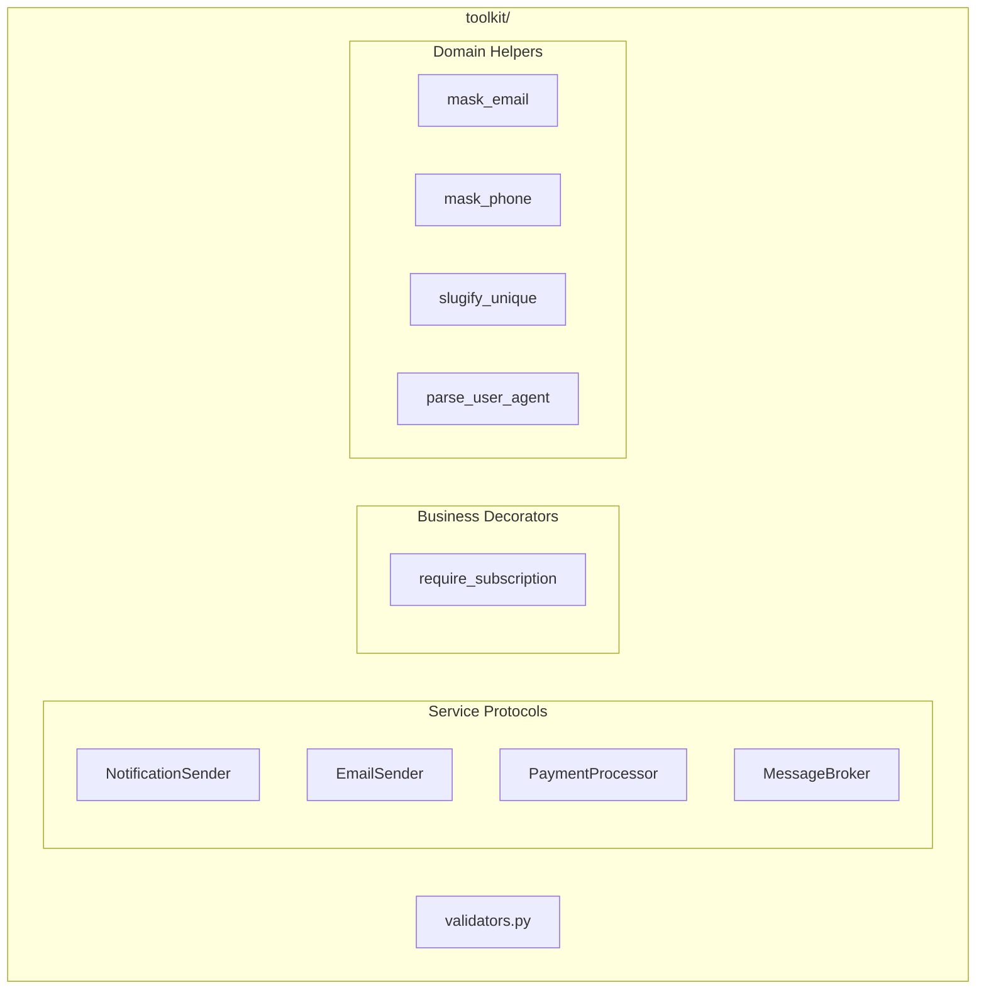
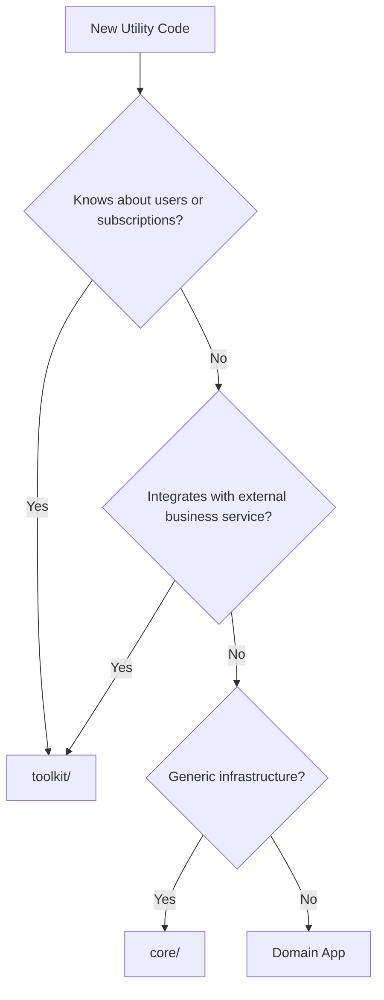

# Toolkit Architecture

> Last generated: 2025-12-15 UTC

**Related Apps:** [core](../core/ARCHITECTURE.md) | [authentication](../authentication/ARCHITECTURE.md) | [payments](../payments/ARCHITECTURE.md)

---

## Overview

The toolkit module provides domain-aware SaaS utilities that understand business concepts like users, subscriptions, and external service integrations. Unlike `core/` which is domain-agnostic, `toolkit/` contains code specific to building user-facing SaaS applications.

### Design Philosophy

Code in `toolkit/` must involve one of:
1. **Knowledge of users** and their relationship with the product
2. **Integration with external business services** (email, payments, notifications)

### Dependencies

| Direction | Apps | Notes |
|-----------|------|-------|
| **Imports from** | `core` | Base infrastructure |
| **Imported by** | Domain apps | Decorators, helpers, protocols |

---

## Module Structure



---

## Protocols

Protocols define interfaces for external service integrations using Python's structural typing.

### NotificationSender

Interface for push notification services:

```python
@runtime_checkable
class NotificationSender(Protocol):
    def send(
        self,
        user_id: int,
        title: str,
        body: str,
        **kwargs: Any,
    ) -> bool:
        """Send notification to user."""
        ...
```

**Implementations:** FCM service, APNS service

### EmailSender

Interface for email delivery services:

```python
@runtime_checkable
class EmailSender(Protocol):
    def send(
        self,
        to: str | list[str],
        subject: str,
        body_text: str,
        body_html: str | None = None,
        **kwargs: Any,
    ) -> bool:
        """Send email."""
        ...
```

**Implementations:** SMTP service, SendGrid, Mailgun

### PaymentProcessor

Interface for payment operations:

```python
@runtime_checkable
class PaymentProcessor(Protocol):
    def create_customer(self, user_id: int, email: str) -> str: ...
    def create_subscription(self, customer_id: str, price_id: str, **kwargs) -> dict: ...
    def cancel_subscription(self, subscription_id: str) -> bool: ...
    def process_webhook(self, payload: bytes, signature: str) -> dict: ...
```

**Implementations:** Stripe processor

### MessageBroker

Interface for pub/sub messaging:

```python
@runtime_checkable
class MessageBroker(Protocol):
    def publish(self, channel: str, message: dict) -> None: ...
    def subscribe(self, channel: str) -> None: ...
    def unsubscribe(self, channel: str) -> None: ...
```

**Implementations:** Redis pub/sub, Django Channels

---

## Decorators

### require_subscription

Restrict view access based on subscription status:

```python
from toolkit.decorators import require_subscription

# Require any active subscription
@require_subscription()
def subscriber_feature(request):
    ...

# Require specific plan
@require_subscription(["pro", "enterprise"])
def premium_feature(request):
    ...
```

**Behavior:**
- Returns 401 if not authenticated
- Returns 403 if no active subscription
- Returns 403 if subscription plan not in allowed list

---

## Helpers

### PII Masking

Mask personally identifiable information for display:

```python
from toolkit.helpers import mask_email, mask_phone

mask_email("john.doe@example.com")  # "j***@example.com"
mask_phone("+1-555-123-4567")       # "+1***-***-4567"
```

### Unique Slug Generation

Generate unique slugs with collision handling:

```python
from toolkit.helpers import slugify_unique
from myapp.models import Article

slug = slugify_unique("My Article", Article)
# Returns "my-article" or "my-article-2" if exists
```

### User-Agent Parsing

Parse browser/device information for analytics:

```python
from toolkit.helpers import parse_user_agent

info = parse_user_agent(request.META.get("HTTP_USER_AGENT", ""))
# Returns: {"device_type": "mobile", "browser": "Chrome", "os": "iOS", "raw": "..."}
```

---

## Core vs Toolkit Decision Guide



### Belongs in toolkit/

- `require_subscription` - Checks user's subscription tier
- `mask_email` - Handles PII for display
- `EmailSender` protocol - Business communication interface
- `PaymentProcessor` protocol - Revenue-related operations

### Belongs in core/ (NOT toolkit/)

- `rate_limit` - Generic API protection
- `generate_token` - Cryptographic utility
- `validate_file_size` - Generic file validation
- `CacheBackend` - Infrastructure interface

---

## Usage Examples

### Using Protocols for Dependency Injection

```python
from toolkit.protocols import NotificationSender, EmailSender

class OrderService:
    def __init__(
        self,
        notification_sender: NotificationSender,
        email_sender: EmailSender,
    ):
        self.notifications = notification_sender
        self.email = email_sender

    def complete_order(self, order):
        # Send push notification
        self.notifications.send(
            order.user_id,
            "Order Complete",
            f"Order #{order.id} has been completed",
        )

        # Send confirmation email
        self.email.send(
            order.user.email,
            "Order Confirmation",
            f"Your order #{order.id} is complete.",
        )
```

### Testing with Protocols

```python
class MockNotificationSender:
    def __init__(self):
        self.sent = []

    def send(self, user_id, title, body, **kwargs):
        self.sent.append({"user_id": user_id, "title": title, "body": body})
        return True

def test_order_completion():
    mock_sender = MockNotificationSender()
    service = OrderService(notification_sender=mock_sender, email_sender=...)

    service.complete_order(order)

    assert len(mock_sender.sent) == 1
    assert mock_sender.sent[0]["user_id"] == order.user_id
```

---

## File Reference

| File | Purpose | Key Contents |
|------|---------|--------------|
| `protocols.py` | Service interfaces | `NotificationSender`, `EmailSender`, `PaymentProcessor`, `MessageBroker` |
| `decorators.py` | Business-aware decorators | `require_subscription` |
| `helpers.py` | Domain utilities | `mask_email`, `mask_phone`, `slugify_unique`, `parse_user_agent` |
| `validators.py` | Domain validation | `validate_phone_number` |
